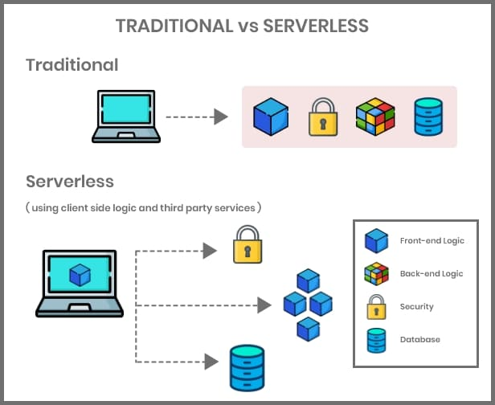
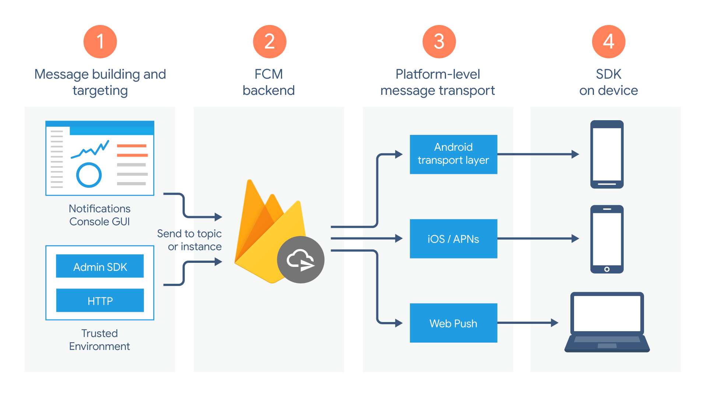

## Questão 03

Pesquise outros "modelos como serviço" diferentes dos três modelos tradicionais (IaaS, PaaS, SaaS).  
a. Descreva o modelo  
b. Desenhe uma figura que represente o modelo (ou encontre uma figura que o represente - com o link)  
c. Exemplifique seu uso 

---

### FaaS - Function as a Service

**Descrição do modelo:** FaaS (Function as a Service / Função como Serviço) Este modelo, frequentemente associado à computação "sem servidor" (serverless), permite que os desenvolvedores criem, executem e gerenciem pacotes de código (funções) sem a necessidade de gerenciar a infraestrutura subjacente. A plataforma executa o código apenas quando disparada por um evento específico e escala automaticamente.

**Figura representativa:**  

**Exemplifique seu uso** O uso clássico de FaaS ocorre no processamento de imagens: quando um usuário faz o upload de uma foto em um site, uma "função" é disparada automaticamente para criar uma miniatura (thumbnail) daquela imagem, salvá-la em um banco de dados e depois a função é encerrada, cobrando apenas pelos segundos de execução. Um exemplo de serviço da AWS que se encaixa neste modelo é o AWS Lambda (embora as fontes o classifiquem genericamente como um serviço de computação).

---

### BaaS - Backend as a Service

**Descrição do modelo:** BaaS (Backend as a Service / Backend como Serviço) Este modelo permite que os desenvolvedores criem, executem e gerenciem pacotes de código (funções) sem a necessidade de gerenciar a infraestrutura subjacente. A plataforma executa o código apenas quando disparada por um evento específico e escala automaticamente. Um exemplo de serviço popularmente utilizado é o **Firebase**, da Google.

**Figura representativa:**  

**Exemplifique seu uso** O uso clássico de BaaS ocorre no processamento de imagens: quando um usuário faz o upload de uma foto em um site, uma "função" é disparada automaticamente para criar uma miniatura (thumbnail) daquela imagem, salvá-la em um banco de dados e depois a função é encerrada, cobrando apenas pelos segundos de execução. Um exemplo de serviço da AWS que se encaixa neste modelo é o AWS Lambda (embora as fontes o classifiquem genericamente como um serviço de computação).
  
> Os dois serviços são um pouco semelhantes, mas a principal diferença é que o BaaS fornece um conjunto completo de serviços de backend prontos para uso (banco de dados, autenticação), enquanto o FaaS oferece um ambiente para executar pequenas porções de código lógico (funções) sob demanda.. Ambos conheci na disciplina de **Arquitetura de Software**.