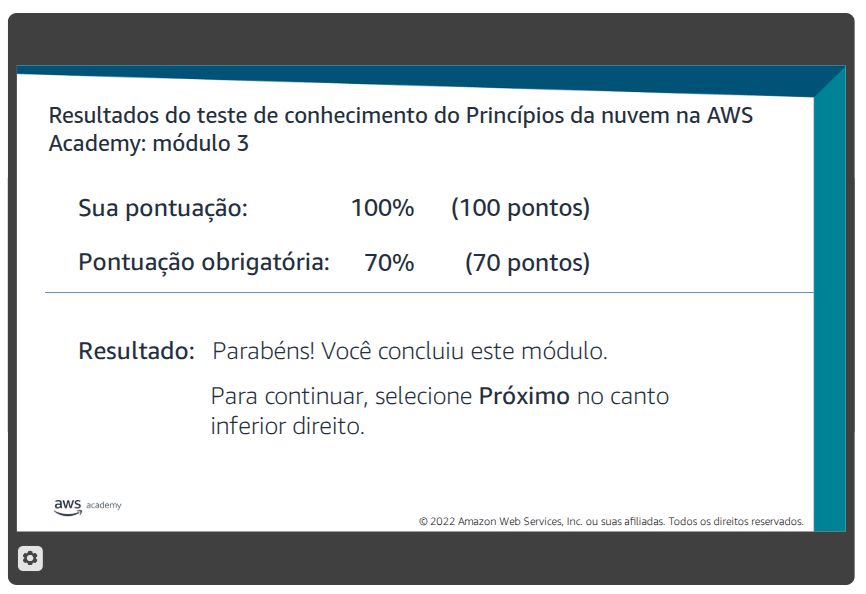

# Atividade 04 - Infraestrutura Global da AWS

## Questão 01
Resolva o Teste de Conhecimento do Módulo 3: Visão geral da infraestrutura global da AWS.  

---

## Questão 02
Responda aos itens a seguir:

1. **Quais os fatores que você deve considerar na seleção de uma região da AWS?** Comente brevemente sobre cada um deles.
Ao selecionar a região ideal para armazenar dados e utilizar serviços, você deve considerar os seguintes quatro fatores principais destacados nas fontes:  
- **Governança de dados e requisitos legais**: Este é um fator essencial, pois as leis locais podem exigir que certas informações sejam mantidas dentro de fronteiras geográficas específicas.  
- **Proximidade com os clientes (latência)**: É desejável rodar aplicações em uma região o mais próxima possível dos usuários finais para reduzir a latência (tempo de resposta) e melhorar a experiência do usuário.  
- **Serviços disponíveis na região**: Nem todos os serviços da AWS estão disponíveis em todas as regiões. É necessário verificar se os recursos específicos que sua aplicação exige estão presentes na localidade escolhida.  
- **Custos**: O preço para executar serviços varia entre as regiões. Por exemplo, rodar uma instância Amazon EC2 em Ohio pode ser mais barato do que em Tóquio.  

2. **Acesse a Infraestrutura da AWS e liste todas as regiões disponíveis que possuem um número de zonas de disponibilidade maior ou igual a três.** Cite o nome da região e a quantidade de zonas.   
Regiões disponíveis que possuem atualmente um número de zonas de disponibilidade maior ou igual a três:

**Américas**
- Leste dos EUA (Norte da Virgínia): 6 Zonas
- Leste dos EUA (Ohio): 3 Zonas
- Oeste dos EUA (Norte da Califórnia): 3 Zonas
- Oeste dos EUA (Oregon): 4 Zonas
- Canadá (Central): 3 Zonas
- América do Sul (São Paulo): 3 Zonas

**Europa / Oriente Médio / África**
- Europa (Frankfurt): 3 Zonas
- Europa (Irlanda): 3 Zonas
- Europa (Londres): 3 Zonas
- Europa (Paris): 3 Zonas
- Europa (Estocolmo): 3 Zonas
- Europa (Milão): 3 Zonas
- Europa (Espanha): 3 Zonas
- Europa (Zurique): 3 Zonas
- Oriente Médio (Bahrein): 3 Zonas
- Oriente Médio (EAU): 3 Zonas
- África (Cidade do Cabo): 3 Zonas
  
**Ásia-Pacífico**
- Ásia-Pacífico (Tóquio): 4 Zonas
- Ásia-Pacífico (Seul): 4 Zonas
- Ásia-Pacífico (Cingapura): 3 Zonas
- Ásia-Pacífico (Sydney): 3 Zonas
- Ásia-Pacífico (Mumbai): 3 Zonas
- Ásia-Pacífico (Hong Kong): 3 Zonas
- Ásia-Pacífico (Osaka): 3 Zonas
- Ásia-Pacífico (Jacarta): 3 Zonas
- Ásia-Pacífico (Hyderabad): 3 Zonas
- Ásia-Pacífico (Melbourne): 3 Zonas

---

## Questão 03
Para cada categoria de serviços da AWS abaixo, cite e defina três serviços. A definição pode ser curta (uma frase). Informe também o link para a página de documentação oficial.

### **Armazenamento**
*   **Amazon Simple Storage Service (Amazon S3):** É um serviço de armazenamento de objetos que oferece escalabilidade, disponibilidade de dados, segurança e desempenho para armazenar e proteger qualquer quantidade de dados.  [https://aws.amazon.com/pt/s3/](https://aws.amazon.com/pt/s3/)
*   **Amazon Elastic Block Store (Amazon EBS):** Fornece volumes de armazenamento em bloco de alto desempenho projetados para uso com o Amazon EC2 para cargas de trabalho intensivas em taxa de transferência e transações. [https://aws.amazon.com/pt/ebs/](https://aws.amazon.com/pt/ebs/)
*   **Amazon Elastic File System (Amazon EFS):** Fornece um sistema de arquivos Network File System (NFS) elástico, escalável e totalmente gerenciado para uso com serviços da Nuvem AWS e recursos locais. [https://aws.amazon.com/pt/efs/](https://aws.amazon.com/pt/efs/)

### **Computação**
*   **Amazon Elastic Compute Cloud (Amazon EC2):** Fornece capacidade de computação redimensionável como máquinas virtuais na nuvem, oferecendo controle total sobre os recursos de computação. [https://aws.amazon.com/pt/ec2/](https://aws.amazon.com/pt/ec2/)
*   **AWS Lambda:** É um serviço de computação sem servidor que permite executar código sem provisionar ou gerenciar servidores, cobrando apenas pelo tempo de computação consumido. [https://aws.amazon.com/pt/lambda/](https://aws.amazon.com/pt/lambda/)
*   **AWS Elastic Beanstalk:** É um serviço de plataforma como serviço (PaaS) para implantar e escalonar aplicações e serviços web desenvolvidos com linguagens familiares em servidores conhecidos. [https://aws.amazon.com/pt/elasticbeanstalk/](https://aws.amazon.com/pt/elasticbeanstalk/)

### **Banco de Dados**
*   **Amazon Relational Database Service (Amazon RDS):** Facilita a configuração, operação e escalonamento de bancos de dados relacionais na nuvem, automatizando tarefas administrativas demoradas. [https://aws.amazon.com/pt/rds/](https://aws.amazon.com/pt/rds/)
*   **Amazon DynamoDB:** É um serviço de banco de dados NoSQL de chave-valor e documentos que oferece latência consistente de milissegundos de um dígito em qualquer escala. [https://aws.amazon.com/pt/dynamodb/](https://aws.amazon.com/pt/dynamodb/)
*   **Amazon Redshift:** É um serviço de data warehouse rápido e totalmente gerenciado que permite executar consultas analíticas complexas em petabytes de dados. [https://aws.amazon.com/pt/redshift/](https://aws.amazon.com/pt/redshift/)

### **Rede e Entrega de Conteúdo**
*   **Amazon Virtual Private Cloud (Amazon VPC):** Permite provisionar seções logicamente isoladas da Nuvem AWS, onde você pode lançar recursos em uma rede virtual definida por você. [https://aws.amazon.com/pt/vpc/](https://aws.amazon.com/pt/vpc/)
*   **Amazon CloudFront:** É um serviço de rede de entrega de conteúdo (CDN) que entrega dados, vídeos e aplicações globalmente com baixa latência e altas velocidades de transferência. [https://aws.amazon.com/pt/cloudfront/](https://aws.amazon.com/pt/cloudfront/)
*   **Amazon Route 53:** É um serviço web de Sistema de Nomes de Domínio (DNS) na nuvem altamente disponível e escalável, projetado para rotear usuários para aplicações de internet. [https://aws.amazon.com/pt/route53/](https://aws.amazon.com/pt/route53/)

---

## Questão 04 - No laboratório (Entrega via MOODLE)
**Prática: Regiões e Zonas de Disponibilidade da Amazon**

[acesso para questao 04](./questao%2004/)  

*Instruções: Faça um relatório em PDF com telas e breves comentários. Inicie o ambiente Sandbox e conecte-se ao Console de Gerenciamento da AWS.*

### 1. Categorias de Serviço
No menu **Serviços**, observe o agrupamento por categorias. Responda:
*   Em qual categoria o serviço **IAM** aparece?
*   Em qual categoria o serviço **RDS** aparece?
*   Em qual categoria o serviço **AWS Cost Explorer** aparece?
*   Em qual categoria o serviço **CloudWatch** aparece?
*   Em qual categoria o serviço **VPC** aparece?

### 2. Regiões da AWS
No serviço **VPC**, alterne a região no menu superior direito (ex: mude para EU London).
*   O que acontece ao alterar a região?

### 3. Sub-redes (Subnets)
Selecione uma sub-rede e observe os detalhes na parte inferior:
*   Para cada sub-rede selecionada, a informação exibida é de nível de região ou de zona de disponibilidade?
*   Liste a zona de disponibilidade para cada sub-rede.

### 4. Suas VPCs (Your VPCs)
*   Quantas VPCs existem?
*   Para cada VPC selecionada, a informação exibida é de nível de região ou de zona de disponibilidade?

### 5. EC2
*   Quantas instâncias existem?
*   Para cada instância selecionada, a informação é de nível de região ou de zona de disponibilidade?
*   Liste a região para cada instância.
*   Qual o tipo de instância e suas características?
*   Qual o sistema operacional?

### 6. Painel de Controle
Vá para a página inicial do console:
*   Liste os serviços visitados.
*   Encontre o painel "Custo e Uso" e verifique se há algum custo na conta.
