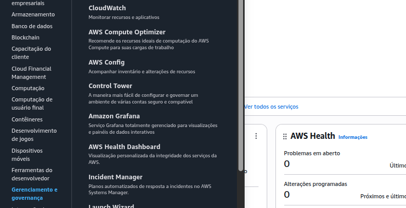
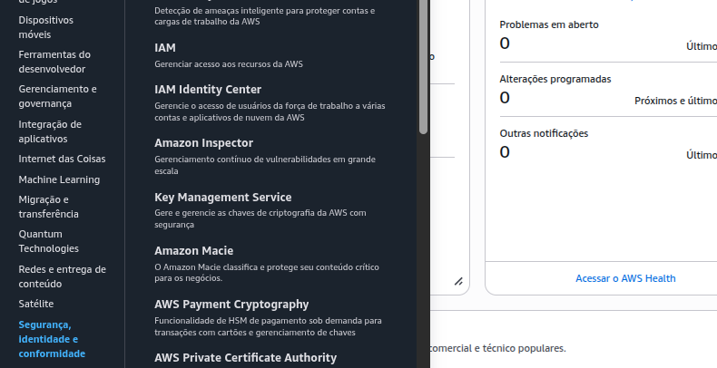
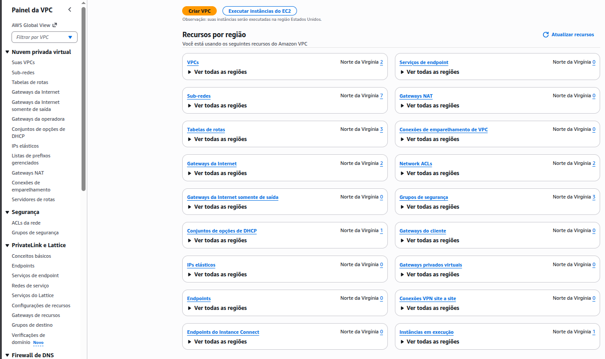
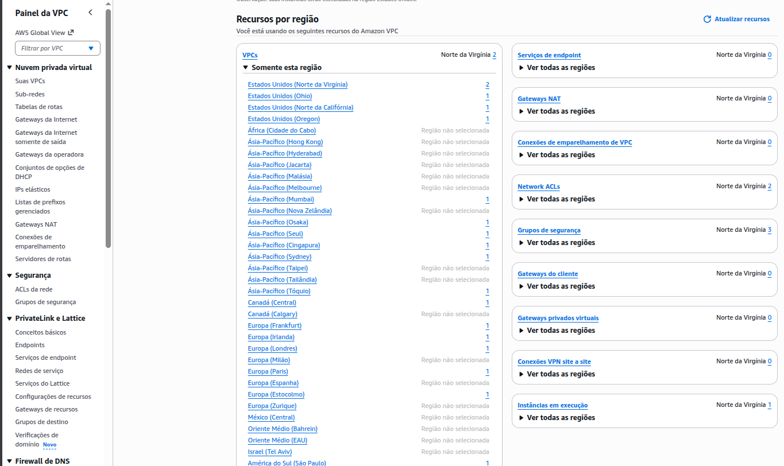
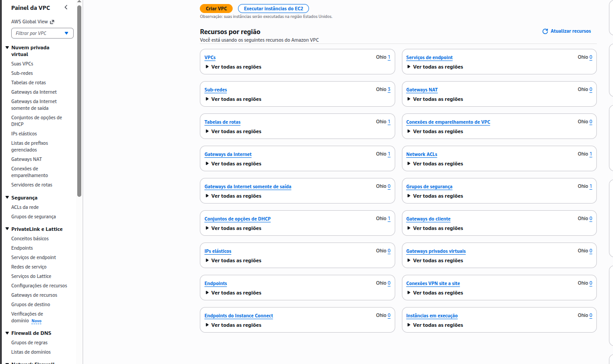
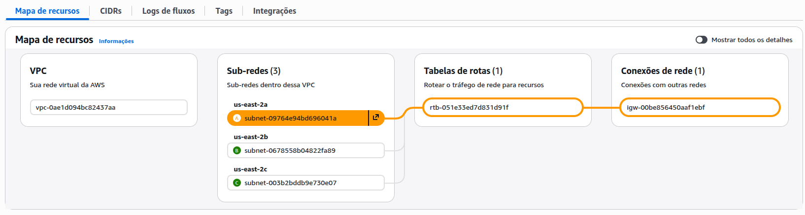
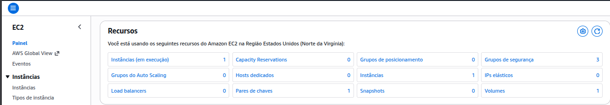
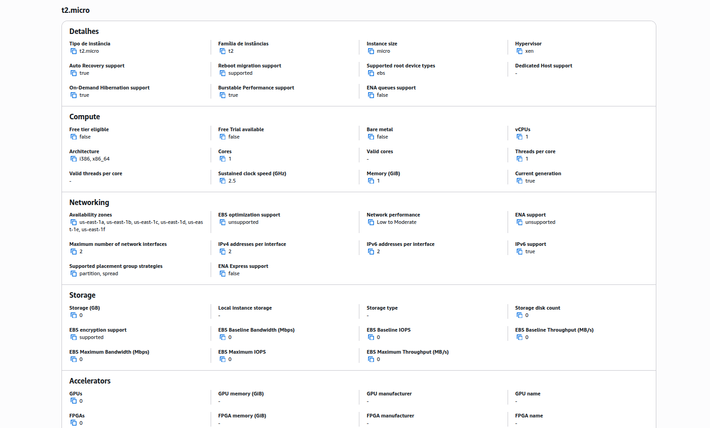

# 1. Categorias de Serviço

No menu **Serviços**, observe o agrupamento por categorias. Responda:

* Em qual categoria o serviço **IAM** aparece?  
Segurança, identidade e conformidade

* Em qual categoria o serviço **RDS** aparece?  
Banco de dados

* Em qual categoria o serviço **AWS Cost Explorer** aparece?  
Gerenciamento financeiro da AWS

* Em qual categoria o serviço **CloudWatch** aparece?  
Gerenciamento e governança

* Em qual categoria o serviço **VPC** aparece?  
Rede e entrega de conteúdo
  

> Pesquisei os serviços na barra de pesquisa dos serviços.

# 2. Regiões da AWS

No serviço **VPC**, alterne a região no menu superior direito (ex: mude para EU London).

> Mudei de eu-west-1 (Norte da Virgínia) para eu-west-2 (Ohio).

* O que acontece ao alterar a região?

## Default

## Ohio

Os recursos exibidos mudaram: VPCs, sub-redes e alguns outros recursos que existem naquela região específica.
* Antes tinha 7 sub-redes e agora tem 3.
* VPCs, tinha 2 e agora tem 1.
* Tabelas de rotas, tinha 3 e agora tem 1.

# 3. Sub-redes (Subnets)

Selecione uma sub-rede e observe os detalhes na parte inferior:

* Para cada sub-rede selecionada, a informação exibida é de nível de região ou de zona de disponibilidade?
* Liste a zona de disponibilidade para cada sub-rede.

* Sub-rede 1: use2-az2 (us-east-2b)
* Sub-rede 2: use2-az1 (us-east-2a)
* Sub-rede 3: use2-az3 (us-east-2c)

> A informação exibida é de nível de zona de disponibilidade.

# 4. Suas VPCs (Your VPCs)

* Quantas VPCs existem?
* Para cada VPC selecionada, a informação exibida é de nível de região ou de zona de disponibilidade?

Sobre as informações exibidas na imagem, podemos concluir que:
As zonas de disponibilidade apresentadas são:
* subnet-09764e94bd696041a: us-east-2a
* subnet-0678558b04822fa89: us-east-2b
* subnet-003b2bddb9e730e07: us-east-2c

> Existem 3 VPCs. A informação exibida é de nível de região.

# 5. EC2

* Quantas instâncias existem?
* Para cada instância selecionada, a informação é de nível de região ou de zona de disponibilidade?
* Liste a região para cada instância.
* Qual o tipo de instância e suas características?
* Qual o sistema operacional?

## Respostas

* Existem 1 instâncias.
* Zona de disponibilidade: us-east-2a
* Região: us-east-1
* Tipo de instância: t2.micro
* Sistema operacional: Linux/UNIX

# 6. Painel de Controle

Vá para a página inicial do console:

* Liste os serviços visitados.
* Encontre o painel "Custo e Uso" e verifique se há algum custo na conta.

## Respostas

* Serviços visitados: VPC, EC2 e o Cost Explorer
* Custo na conta: R$ 0,00
