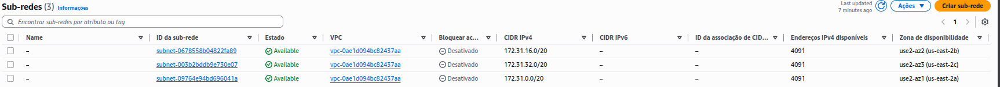

# 3. Sub-redes (Subnets)
Selecione uma sub-rede e observe os detalhes na parte inferior:
*   Para cada sub-rede selecionada, a informação exibida é de nível de região ou de zona de disponibilidade?
*   Liste a zona de disponibilidade para cada sub-rede.

- Sub-rede 1: use2-az2 (us-east-2b)
- Sub-rede 2: use2-az1 (us-east-2a)
- Sub-rede 3: use2-az3 (us-east-2c)

> A informação exibida é de nível de zona de disponibilidade.
