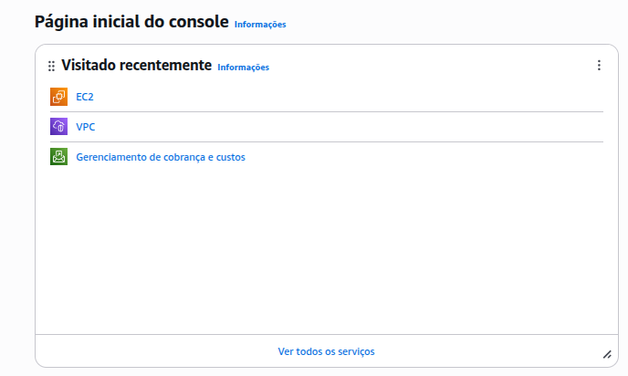
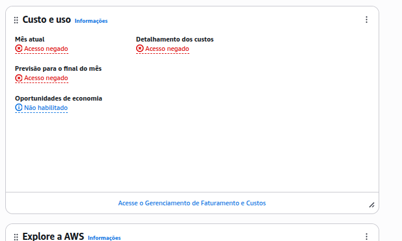

# 6. Painel de Controle
Vá para a página inicial do console:
*   Liste os serviços visitados.
*   Encontre o painel "Custo e Uso" e verifique se há algum custo na conta.

## Respostas

- Serviços visitados: VPC, EC2 e o Cost Explorer
- Custo na conta: R$ 0,00