# Relatório: Laboratório 1 - Introdução ao AWS IAM

O relatório para comprovar a realização das atividades do Laboratório 1 (Introdução ao AWS IAM) do curso AWS Cloud Foundations, detalhando o processo passo-a-passo.

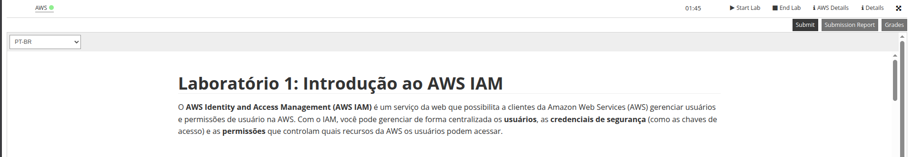
Início do laboratório, marcando o provisionamento do ambiente da AWS e a inicialização de seus recursos. 

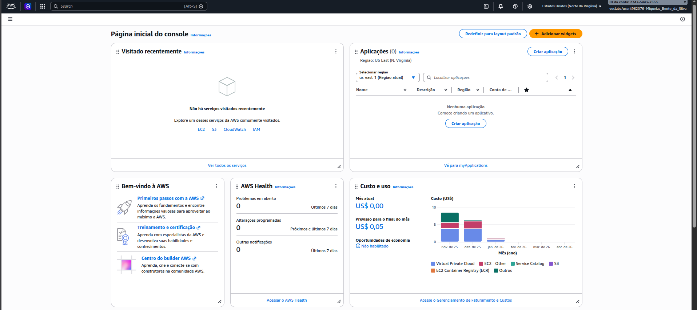
Tela do Console de Gerenciamento da AWS exibida imediatamente após efetuar o login com as credenciais geradas para a sessão prática.

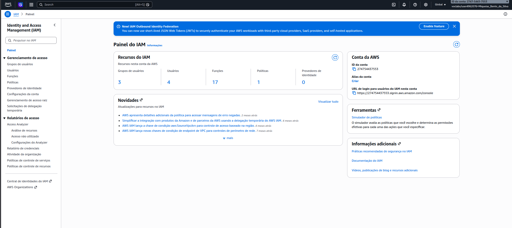
Navegação até o painel principal do IAM, serviço responsável pelo controle de acessos de contas e grupos.

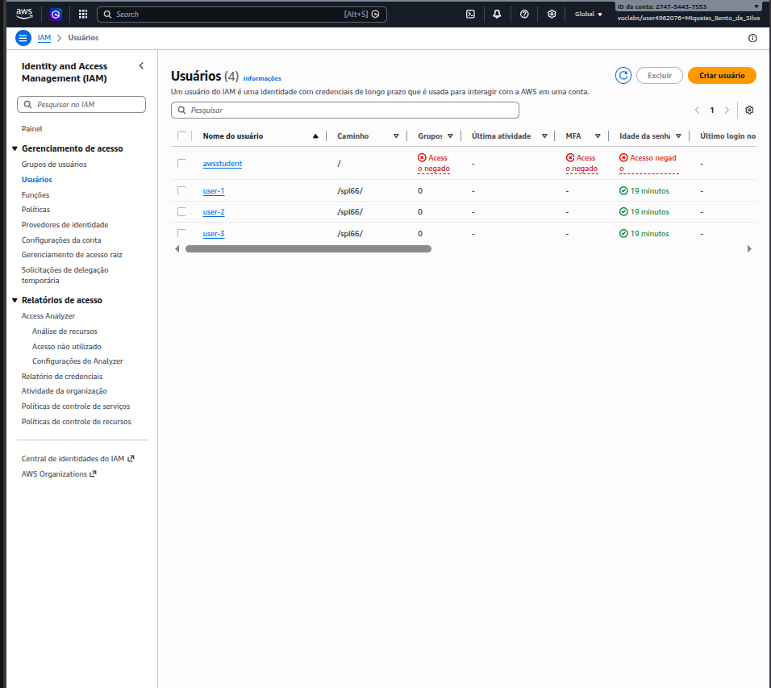
Lista preliminar de usuários no sistema, observada ao começar a manipular permissões e acessos a serviços.

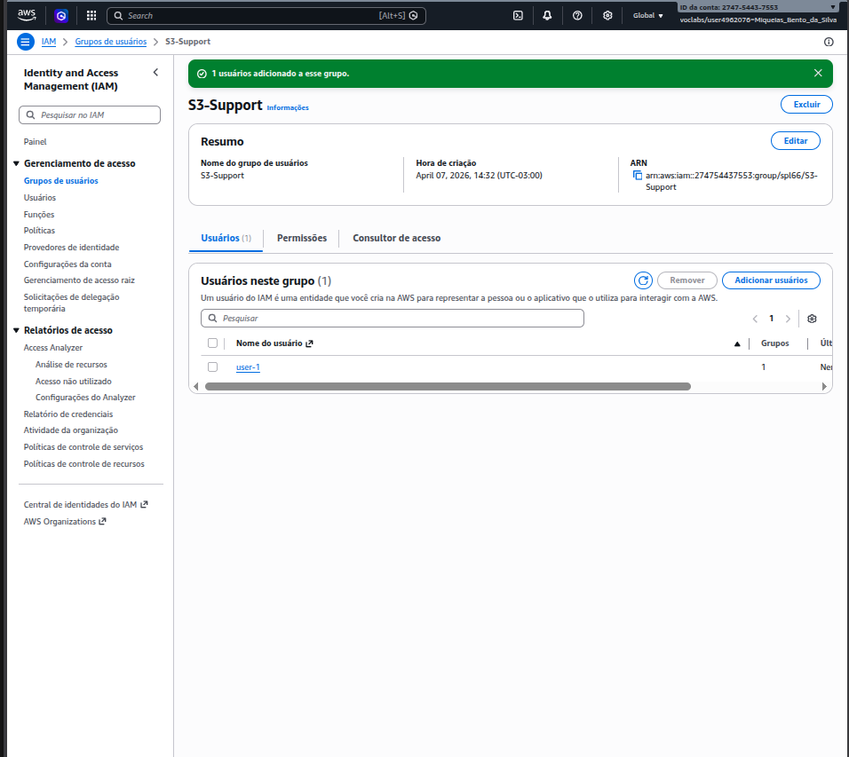
Demonstra a inclusão de um usuário em um grupo IAM específico, ação fundamental para que herde as políticas de permissão ali definidas.

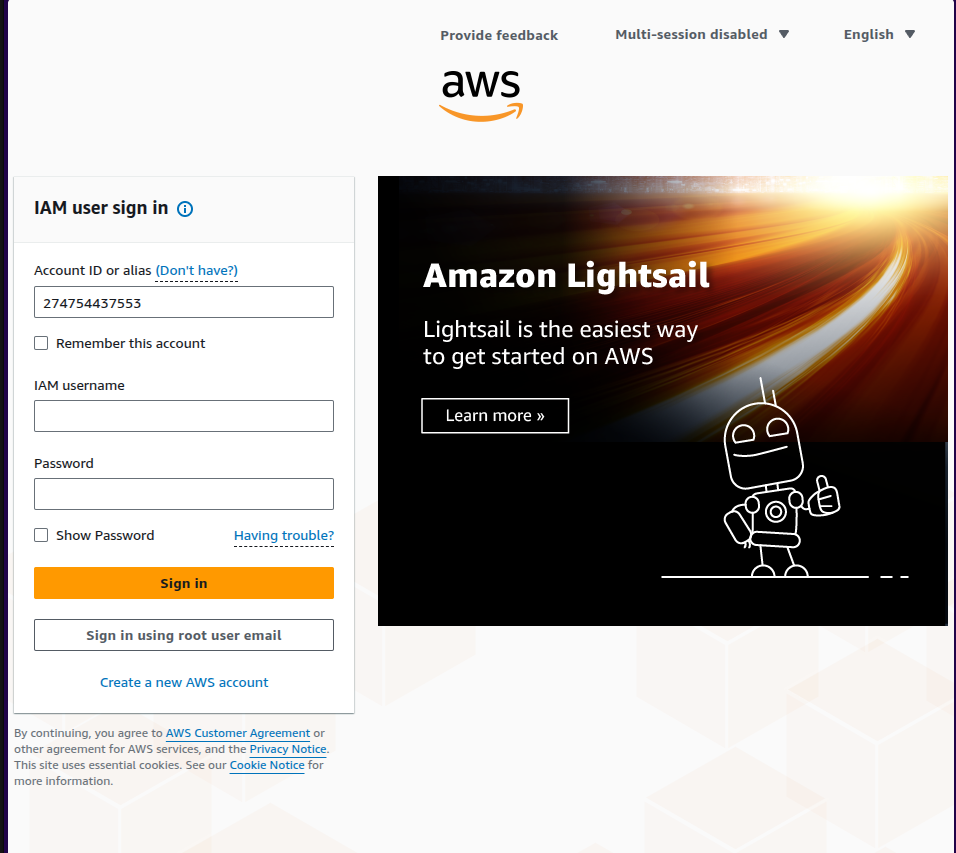
Processo de autenticação ao Console da AWS utilizando a URL temporária e as credenciais atreladas a um dos usuários recém-geridos no IAM.

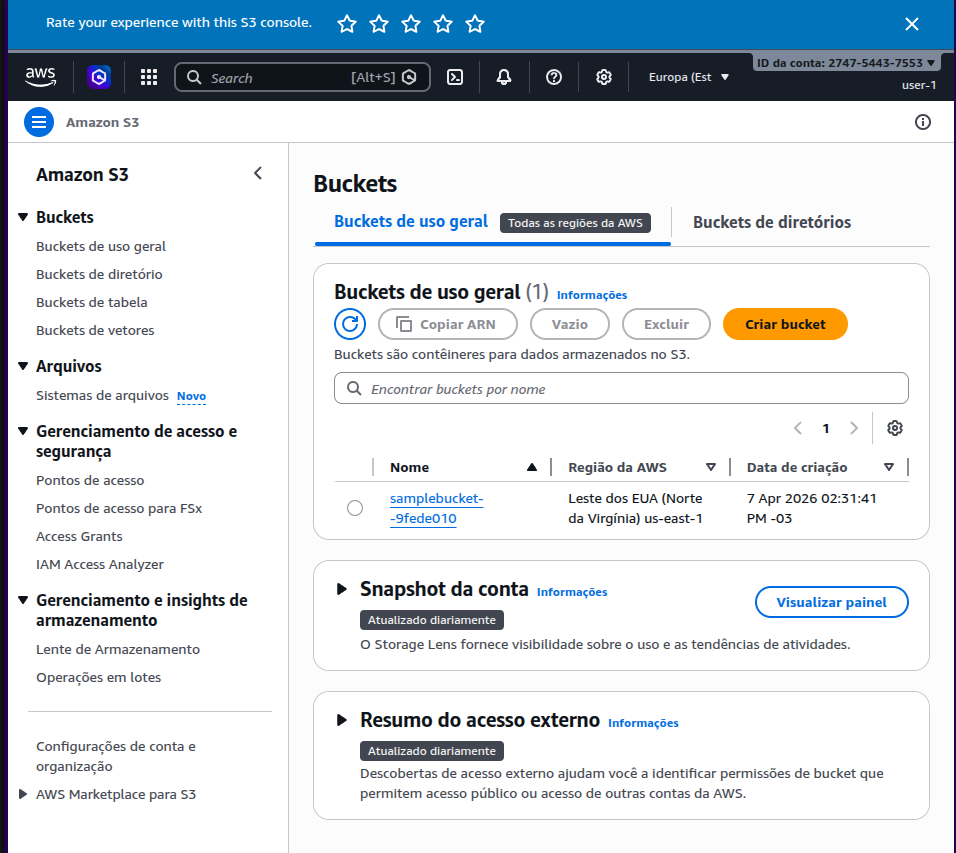
Acesso bem-sucedido do "Usuário 1" no serviço Amazon S3, confirmando que sua conta possui acesso de leitura nos buckets criados.

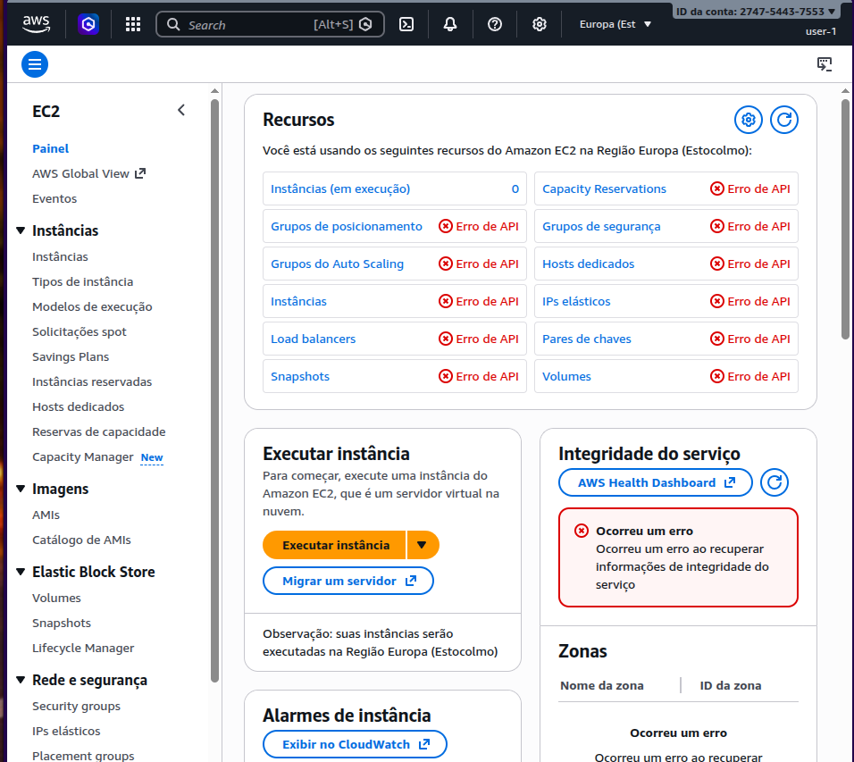
Demonstração da segurança aplicada: o "Usuário 1", embora tenha acesso ao S3, recebe um aviso de permissão negada ao tentar usar ou visualizar recursos do EC2.

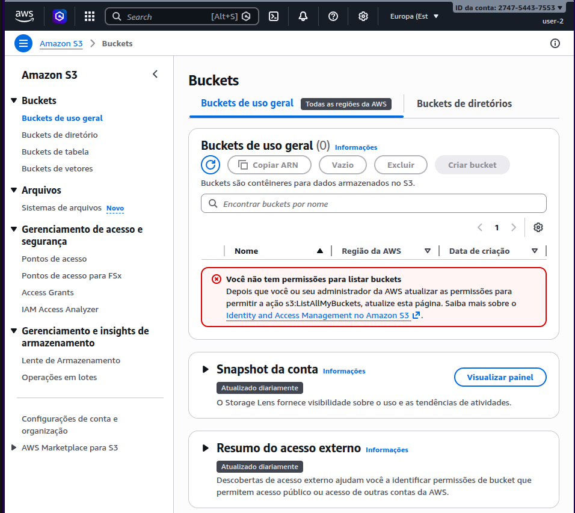
Login como o "Usuário 2", evidenciando sua incapacidade de acesso ao Amazon S3 devido à ausência de políticas concedentes para esse de serviço em seu perfil.

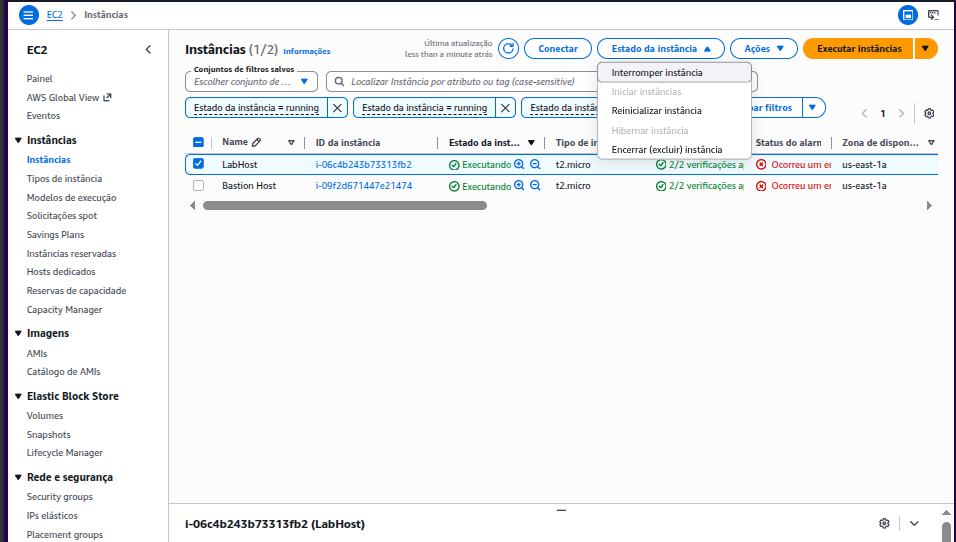
Navegação pelas instâncias EC2 rodando no ambiente para testar a aplicação de métodos administrativos focadas nos diferentes perfis.

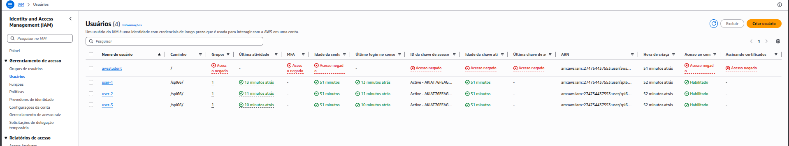
Revisão do painel de usuários na reta final do laboratório, confirmando que todos seguem os parâmetros das atividades.

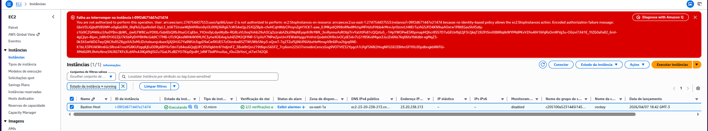
Tentativa frustrada de parada da instância do EC2 por um usuário cujas permissões do IAM barra explicitamente esse nível de controle no serviço de computação.

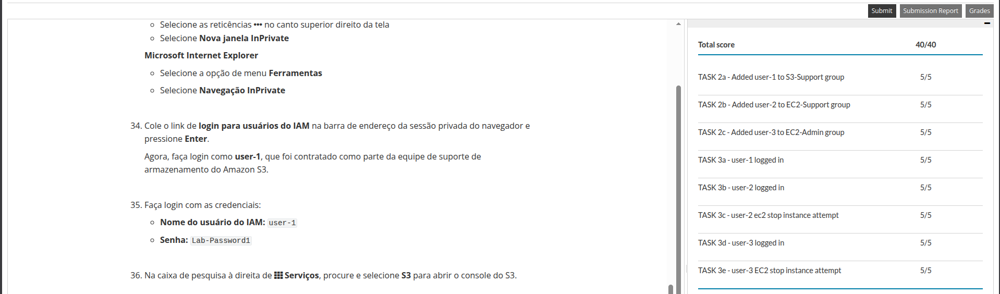
Finalização total do lab, e antes disso ainda tive que reenviar um ponto que tinha esquecido de fazer, que foi o do usuário 2, mas deu certo!

> Tive que parar o primeiro lab e perdi por conta do tempo de expiração que é de 2h, mas consegui refazer e fazer o segundo lab e submeter.
