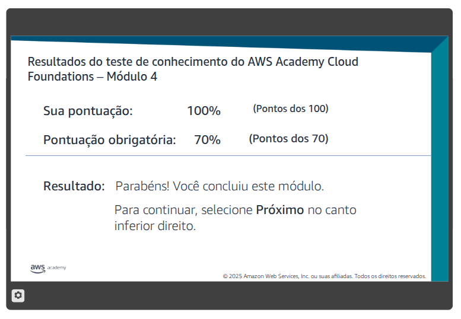

# Segurança na nuvem

## Questão 01

Resolva o Teste de Conhecimento do Módulo 4 - Segurança na nuvem.

> Teste realizado em 14/04

## Questão 02 - No laboratório

> A ser entregue na aula via MOODLE - 07/04 - não vale se for entregue depois

[Acesso ao laboratório](./Q2%20-%20Lab%201%20de%20Introdução%20ao%20IAM.md)

> Realizado em 07/04

Complete todas as etapas do Laboratório 1 - Introdução ao IAM.

Este é o primeiro laboratório, tem vários detalhes e alguns pontos estão desatualizados. Então sugiro que vocês executem com muita atenção.

Para comprovar esta atividade, elabore um relatório em arquivo PDF contendo descrição passo a passo do laboratório, com imagens, descrição das atividades, comandos utilizados, configurações e resultados.