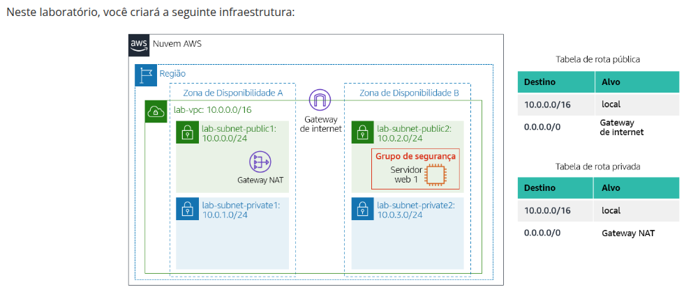
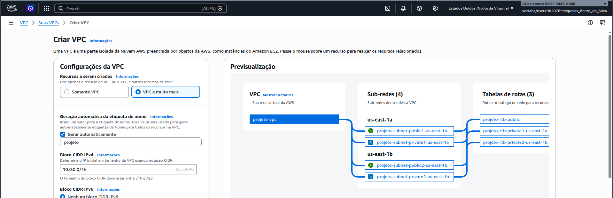
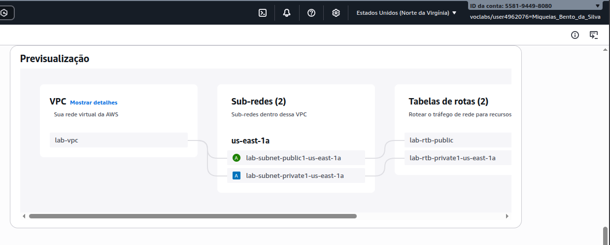
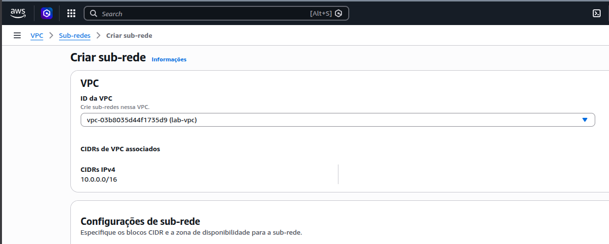
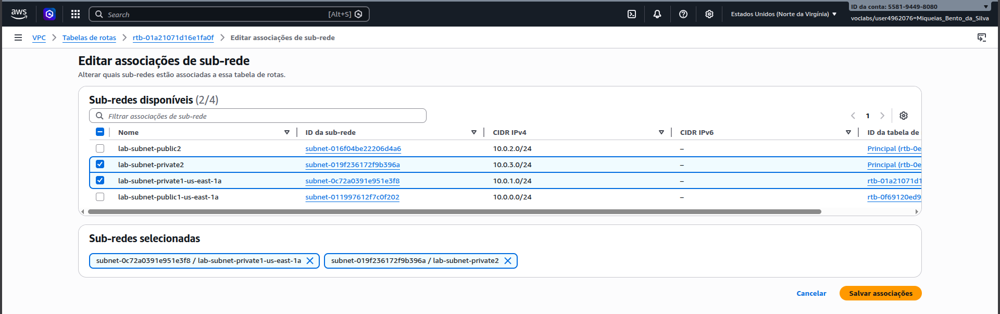
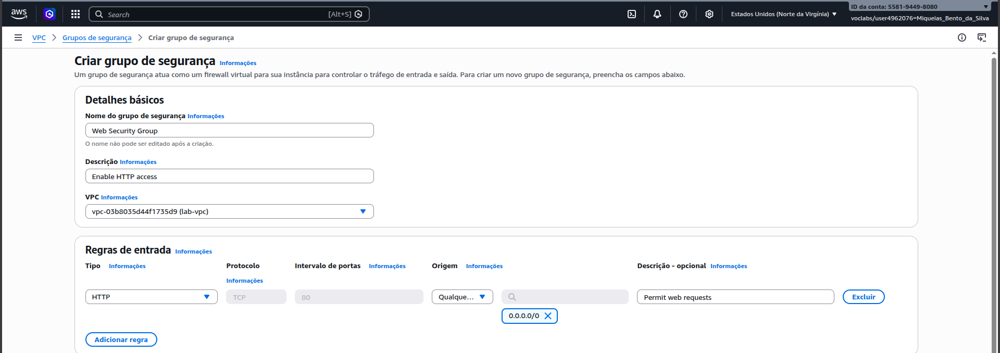
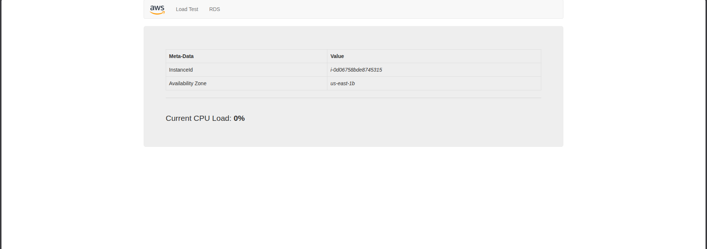

# Laboratório 2 - Crie sua VPC e execute um servidor web

## Descrição

Laboratório para criar uma VPC e executar um servidor web  uma Virtual Private Cloud (VPC) do zero e rodar um servidor nela, conforme atividade proposta de gestão de infraestrutura de redes na AWS.

## Relato da Atividade
Abaixo seguem os registros e algumas registros feitos durante o processo.

Ah, tive problema com alguns passos, mas foi de boa corrigir:
- Tive problema com a Tabela de Rotas da subrede privada, porque não conrregou de início, mas olhando o que tinha de criado na subrede a tabela foi recarregada sozinha, e no fim das contas deu certo.
- No EC2 foi configurado a identificação da máquina, a AMI, o par de chaves, e a configuração de rede, que foi a rede configurada no início do lab.
- Esqueci de mudar a máquina do EC2 de t3.micro para t2.micro e tive que refazer o processo de criar máquina, mas rapidão deu bom.

> Achava que o lab ia ser maior e acabei fazendo poucos registros.

---

## Passos da Execução

Ponto de partida do laboratório, apresentando o desenho do escopo da arquitetura de rede que será implementada na AWS.

Tela de configuração da criação da Virtual Private Cloud (VPC), onde realizei as marcações iniciais e a definição do bloco CIDR IPv4.

Confirmação da criação da VPC, que passa a servir como nossa fundação para as próximas alocações de topologia de rede.

Processo de segmentação da nossa VPC com a criação de subredes, dividindo logicamente em ambientes públicos e privados para maior segurança e controle do tráfego.

Ajuste da Tabela de Rotas para organizar e garantir como o tráfego da rede será transportado ou roteado, inclusive para componentes como Gateways.

Criação e definição das regras do Grupo de Segurança (Security Group), atuando como um firewall para filtrar e autorizar requisições de portas como HTTP e regras na VPC associada.

Comprovação da finalização da atividade mostrando minha instância em execução e lançada de forma bem-sucedida especificamente na VPC (lab-vpc) e subrede que criei manualmente.
