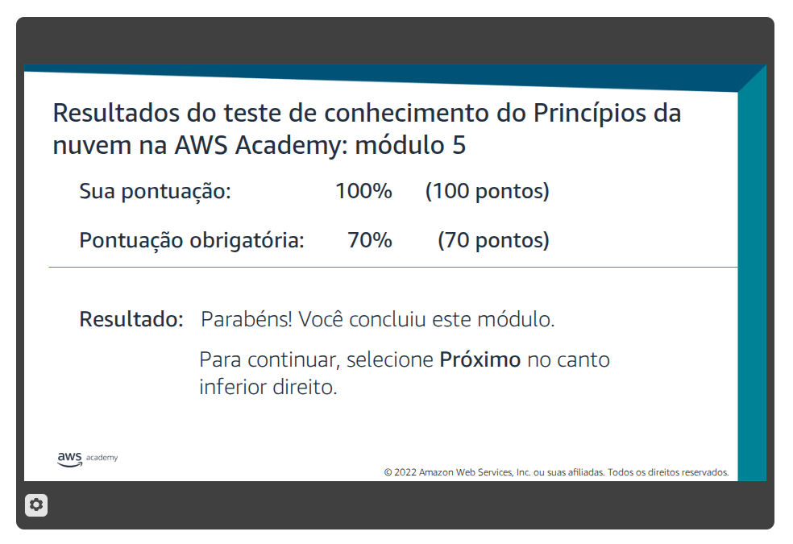

# Atividade 06 - Redes e entrega de conteúdo

## Questão 01

Resolva o Teste de Conhecimento do Módulo 5: Redes e entrega de conteúdo.

## Questão 02

Complete todas as etapas do Laboratório 2 - Crie sua VPC e execute um servidor web.  
Para comprovar estas atividades, eu acessarei a AWS e verificarei a nota do teste e a avaliação do laboratório.  

[Relatório do Laboratório 2](./Lab%202%20-%20Crie%20sua%20VPC%20e%20execute%20um%20servidor.md)
