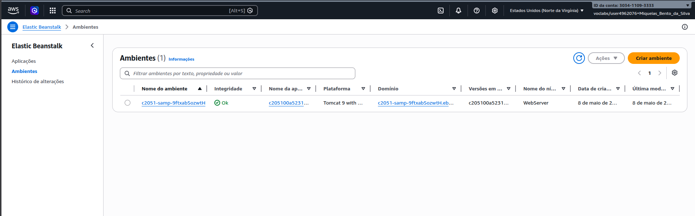
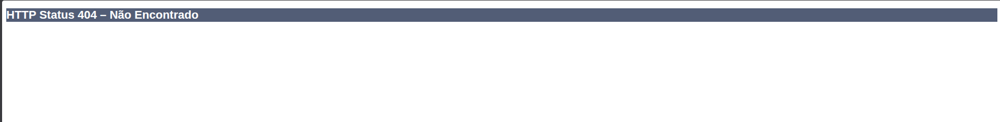
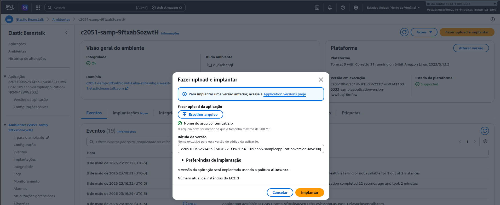
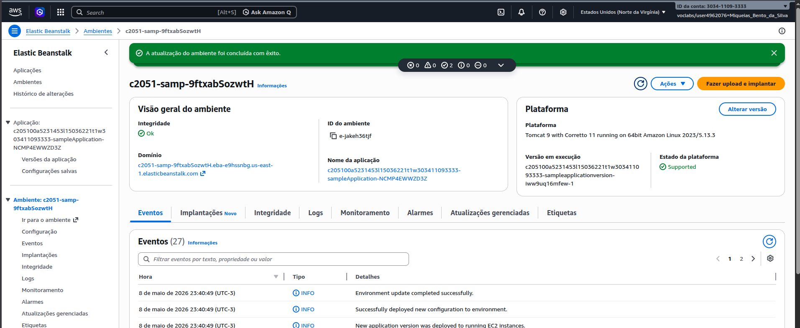
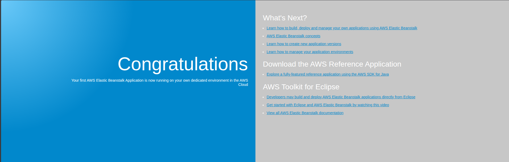
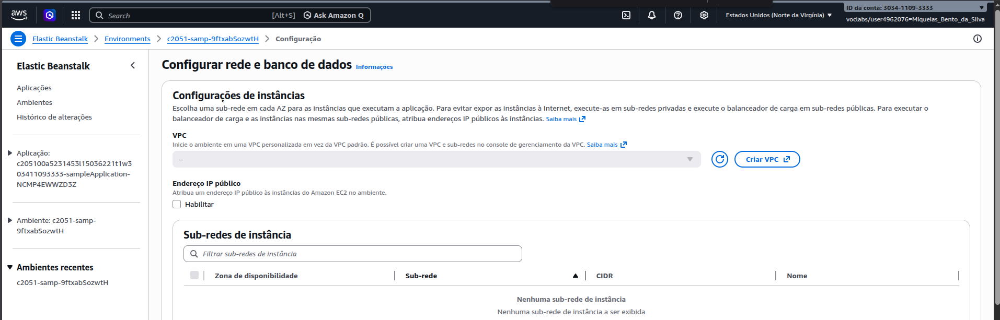
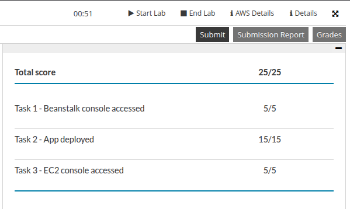

# Relatório: Atividade Lab - AWS Elastic Beanstalk

Atividade laboratório envolvendo o AWS Elastic Beanstalk, focada na implantação e gerenciamento de aplicações web de forma automatizada.

## Relatos
A realização deste lab foi bastante tranquila, uma vez que a maior parte dos passos foi na observação do provisionamento automático e no acesso aos recursos disponibilizados pela plataforma. A automação oferecida pelo Elastic Beanstalk facilitou a gestão da infraestrutura, permitindo focar na entrega da aplicação.

---

## Execução Realizada

Acesso inicial ao console do Elastic Beanstalk para dar início ao processo de criação do ambiente da aplicação.

Verificação do estado inicial do ambiente, constatando a ausência de conteúdo antes da primeira implantação bem-sucedida.

Realização do upload e deploy da nova versão do código-fonte para o ambiente gerenciado.

Acompanhamento do progresso de atualização do ambiente enquanto o serviço processa as alterações e estabiliza os recursos.

Confirmação da disponibilidade da aplicação web via URL pública após a conclusão do processo de implantação.

Ajustes finais nas definições de rede e integração com serviços de dados para garantir a plena operação do ecossistema.

Registro da pontuação final obtida ao término de todas as etapas solicitadas.
