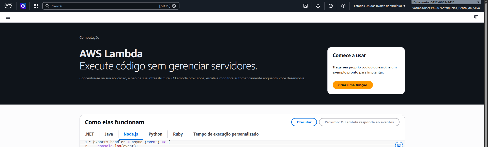
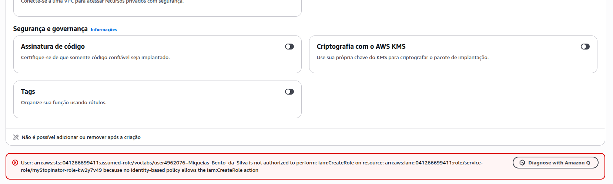
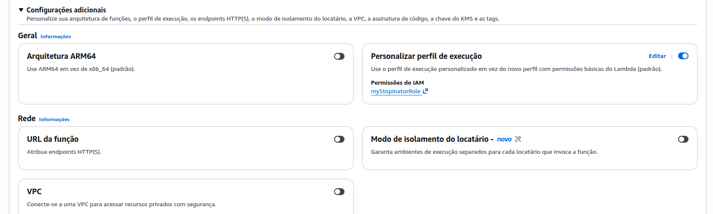
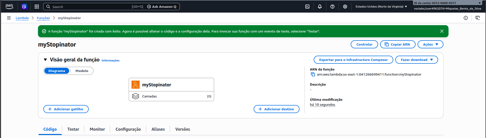
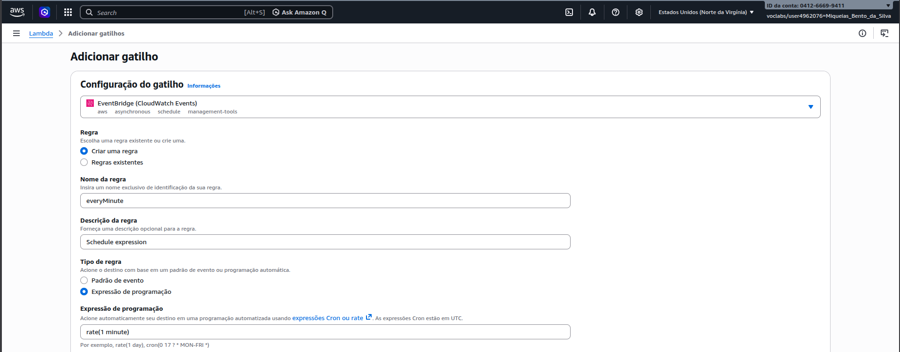
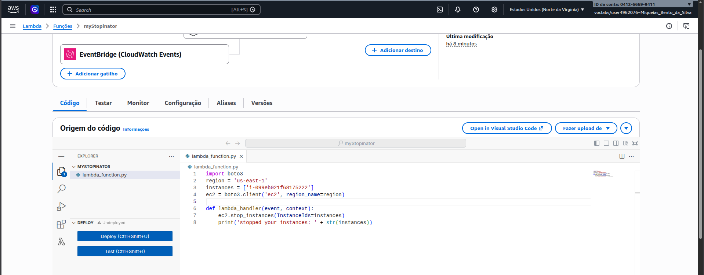
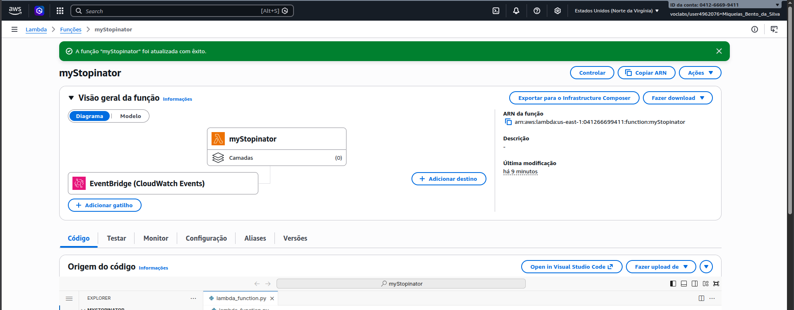
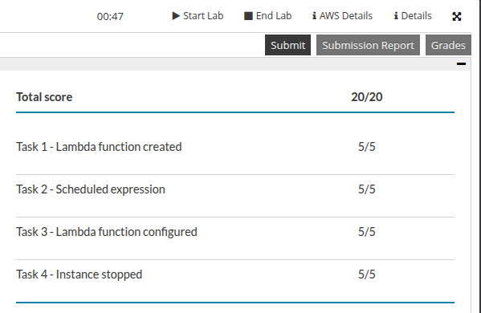

# Relatório: Atividade Lab - AWS Lambda

Atividade laboratório focada no serviço AWS Lambda, abordando desde a criação da função até a configuração de gatilhos e implementação de código.

## Relatos

A execução deste lab se complicou por algumas operações não serem de forma clara ou seguindo o mesmo fluxo que era indicado na instrução, sendo necessários ajustes pontuais em permissões de segurança para a correta inicialização dos recursos, um desses problemas foi a configuração de Role, mas uma vez resolvidas as pendências de configuração de Role, o processo de deploy e teste das funções seguiu conforme já estava instruído, permitindo a validação da lógica implementada e a integração com gatilhos de eventos.

---

## Execução Realizada

Início do provisionamento da função Lambda no console da AWS, com a definição do ambiente de execução e configurações básicas de acesso.

Identificação de um impedimento durante a criação da função devido a inconsistências nas permissões de Role atribuídas.

Realização do ajuste manual nas políticas do IAM, assegurando que a função possuísse os privilégios necessários para sua execução.

Confirmação da criação da função após as correções de segurança, apresentando o ambiente pronto para o desenvolvimento do código.

Associação de gatilhos à função para automação do disparo baseado em eventos específicos do ambiente AWS.

Implementação da lógica de negócio através do editor de código integrado, seguida da configuração dos parâmetros de teste.

Efetivação do deploy da nova versão do código, registrando a atualização bem-sucedida da função no ambiente de computação sem servidor.

Monitoramento do comportamento dos recursos computacionais durante os ciclos de execução e testes da função.

Registro da conclusão total das etapas propostas, com a pontuação final pelo laboratório.
