# Relatório: Laboratório 3 - Introdução ao Amazon EC2

Execução do laboratório de introdução ao Amazon EC2, na qual eu fiz o provisionamento de uma instância e a gestão de recursos como tipo de máquina, grupo de segurança, armazenamento e cotas de serviço.

## Alguns relatos

- Esperava que alterações sobre o tipo de instância fossem mais burocráticas, porém ao longo da atividade foi possível modificar o tipo da instância, o grupo de segurança e até o volume de armazenamento de forma relativamente direta.
- Deu para entender o conceito desse lab e a proposta dele, só demorou bastante para iniciar as instância, pelo menos para mim.

---

## Passos da execução

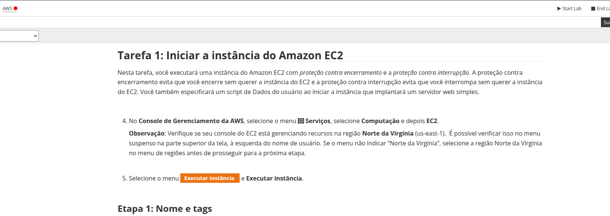
Tela inicial do laboratório, apresentando o ambiente provisionado e o ponto de partida para a configuração da instância EC2.

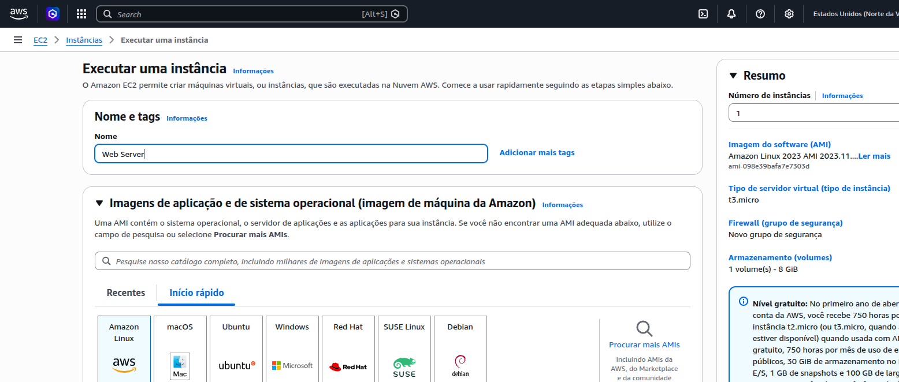
Definição dos parâmetros fundamentais da instância: nome, Amazon Machine Image (AMI) e tipo de instância, configurações que determinam a capacidade computacional do servidor.

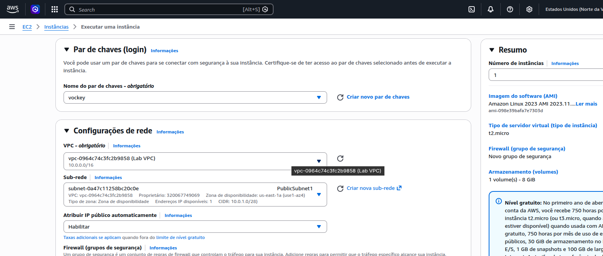
Seleção do par de chaves para acesso seguro via SSH e associação da instância à rede e subrede previamente definidas, pra garantir o isolamento e a conectividade adequados.

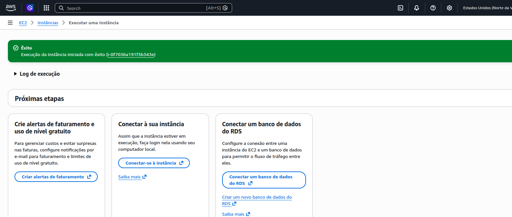
Confirmação de que a instância foi lançada com sucesso e está em processo de inicialização (estado sendo exibido no painel do EC2).

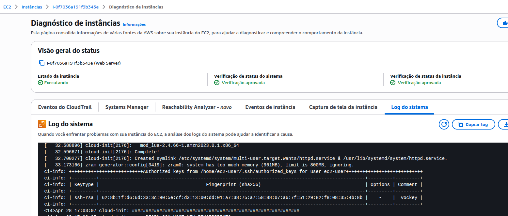
Visualização das métricas de desempenho da instância através do painel de monitoramento, que apresenta dados de utilização de CPU, rede e disco ao longo do tempo.

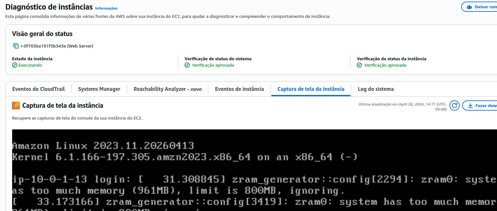
Acesso aos logs de diagnóstico e à saída do sistema, recurso que permite identificar o estado de inicialização e eventuais ocorrências durante o boot da instância.

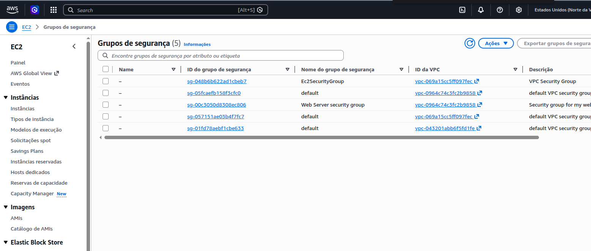
Edição das regras do grupo de segurança associado à instância, habilitando as portas necessárias para o tráfego de entrada, como a porta 80 (HTTP).

Resultado do acesso à instância via navegador após a liberação do tráfego HTTP, confirmando que o servidor web está ativo e respondendo às requisições.

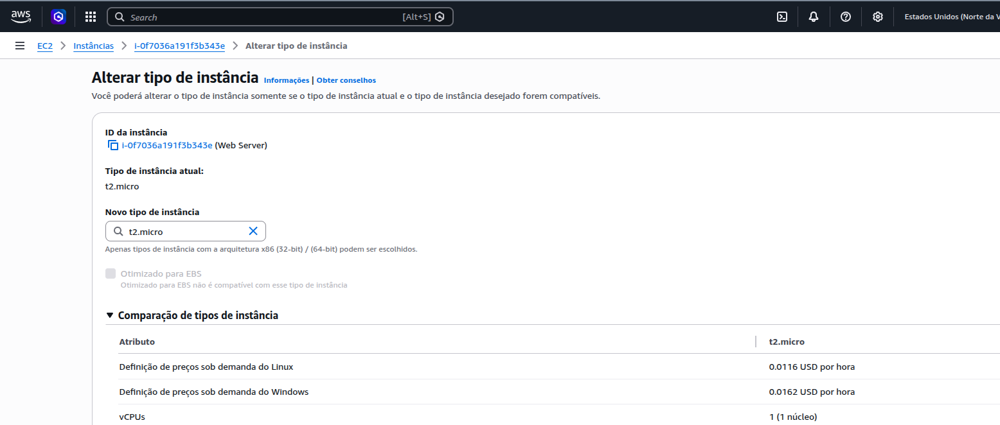
Processo de modificação do tipo da instância com a instância interrompida, pra demonstrar a flexibilidade de ajuste de recursos computacionais sem necessidade de recriação do ambiente.

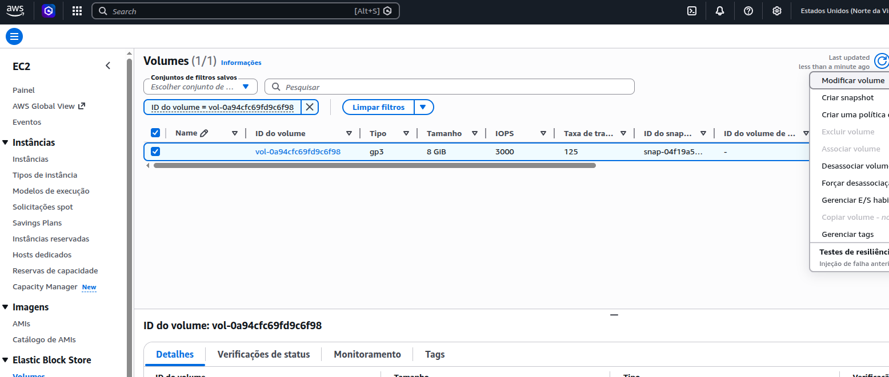
Redimensionamento do volume EBS associado à instância, ampliando a capacidade de armazenamento de forma não destrutiva e sem perda de dados.

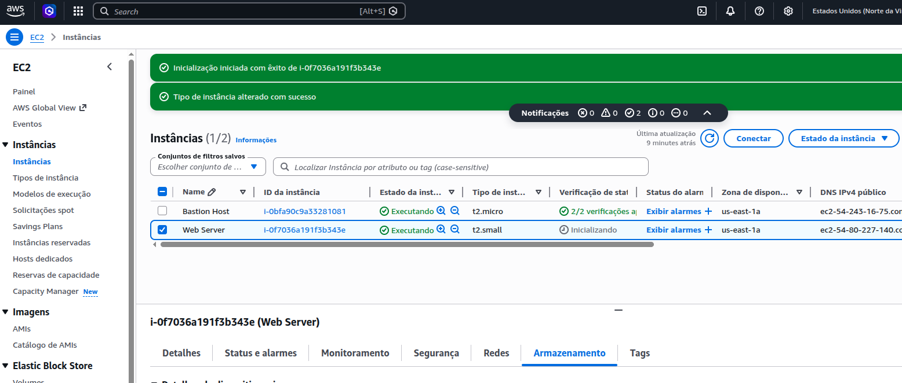
Relançamento da instância após as modificações de tipo e armazenamento, verificando que o ambiente retorna ao estado operacional com os novos parâmetros aplicados.

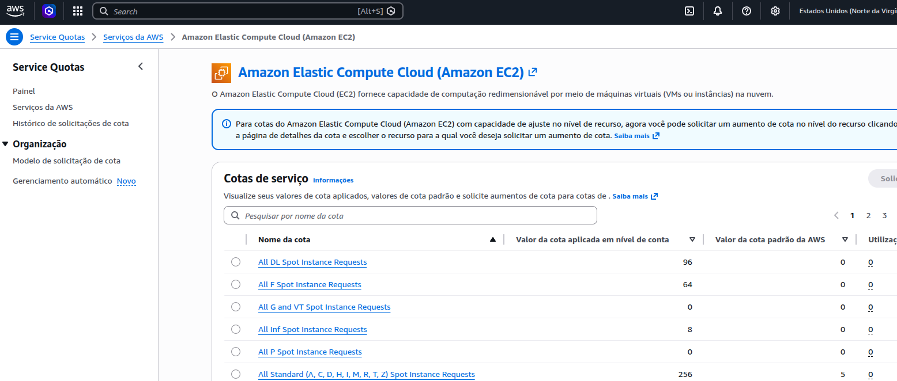
Consulta ao painel de Service Quotas da AWS, onde são exibidos os limites de uso vigentes para os recursos EC2 na conta, como o número máximo de instâncias em execução (não lembrava desse fato que existia um limite de instâncias por região, pelo que entendi né).

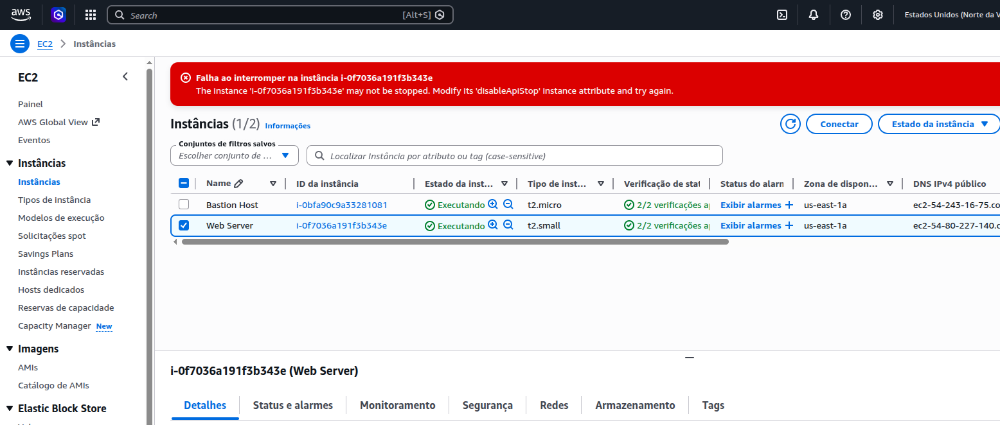
Tentativa de interrupção da instância a partir do painel, mostrando o fluxo de confirmação e as salvaguardar presentes antes de qualquer ação destrutiva sobre o recurso.

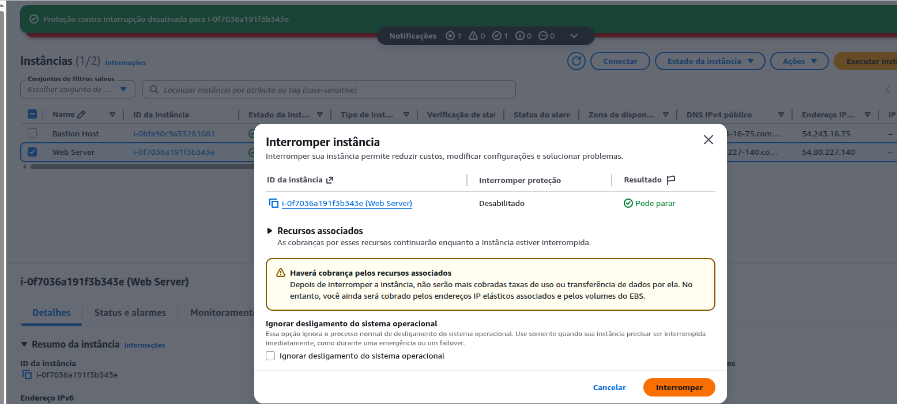
Encerramento de vez da instância ao final do laboratório, com seu estado atualizado para interrompido no console — marcando a conclusão de todas as etapas do lab.
