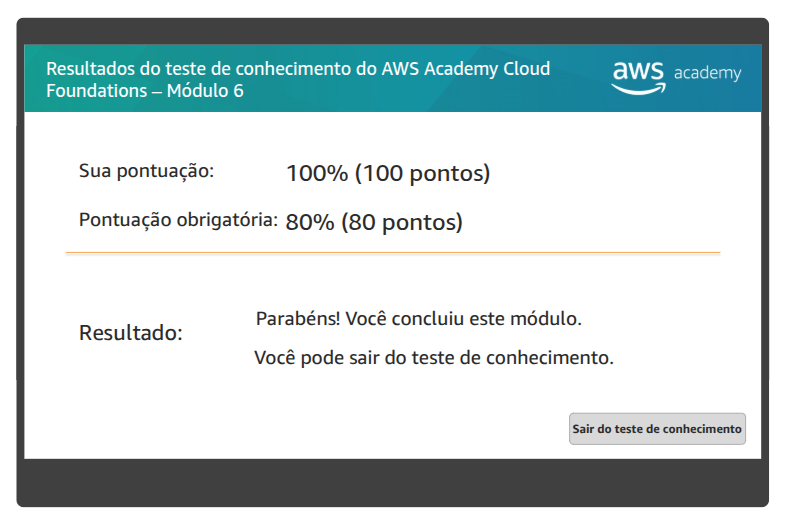

# Atividade 07 - Computação 

## Questão 01
Resolva o Teste de Conhecimento do Módulo 6: Computação.

## Questão 02
> No laboratório - A ser entregue na aula - 28/04 - não vale se for entregue depois

Complete todas as etapas do Laboratório 3 - Introdução ao Amazon EC2. 

Relato: [Lab 3 - Introdução ao Amazon EC2](./Lab%203%20-%20Introdução%20ao%20Amazon%20EC2.md)

## Questão 03
Complete todas as etapas de Atividade: AWS Lambda.

Relato: [Atividade Laboratório Lambda](./Atividade%20Lab%20-%20Lambda.md)

## Questão 04
Complete todas as etapas de Atividade: AWS Elastic Beanstalk.

Para comprovar estas atividades, eu acessarei a AWS e verificarei a nota do teste e a avaliação do laboratório.

Relato: [Atividade Laboratório Elastic Beanstalk](./Atividade%20Lab%20-%20Beanstalk.md)
