# Relatório: Laboratório 4 - Como trabalhar com o EBS

Relatório para documentar a execução do laboratório voltado ao Amazon Elastic Block Store (EBS). 
O Lab foi executado desde a criação e anexação de novos volumes de armazenamento a instâncias EC2, passando pela configuração dos sistemas de arquivos a nível de sistema operacional, até as rotinas de backup e restauração de dados por meio de snapshots.

## Relato da Atividade

Algumas dificuldades que eu tive:
- O registro visual do exato momento de anexação do volume inicial à instância não foi capturado em imagem, no entanto, a operação foi realizada integralmente através do console da AWS.
- O acesso ao terminal da instância EC2 foi conduzido por meio do EC2 Instance Connect, recurso que fornece acesso SSH interativo diretamente pelo navegador.
- Houve um obstáculo temporário ao tentar a conexão padronizada, causado por ligeiras discrepâncias no material traduzido. A resolução consistiu na execução da conexão como administrador pela mesma ferramenta (EC2 Instance Connect).
- No Passo 5 do guia, havia a orientação para exclusão de um arquivo. Como tal arquivo não havia sido gerado ou modificado em passos anteriores, essa exclusão pôde ser ignorada sem que houvesse prejuízo para a correta validação e pontuação final do laboratório.

---

## Passos da Execução

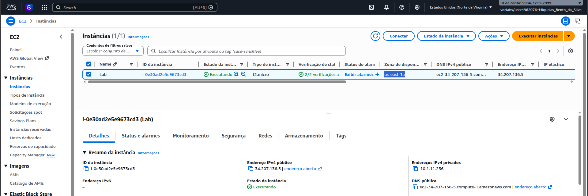
Painel do Amazon EC2 demonstrando o estado de inicialização da instância base designada para o laboratório, a qual será alvo das subsequentes configurações de disco.

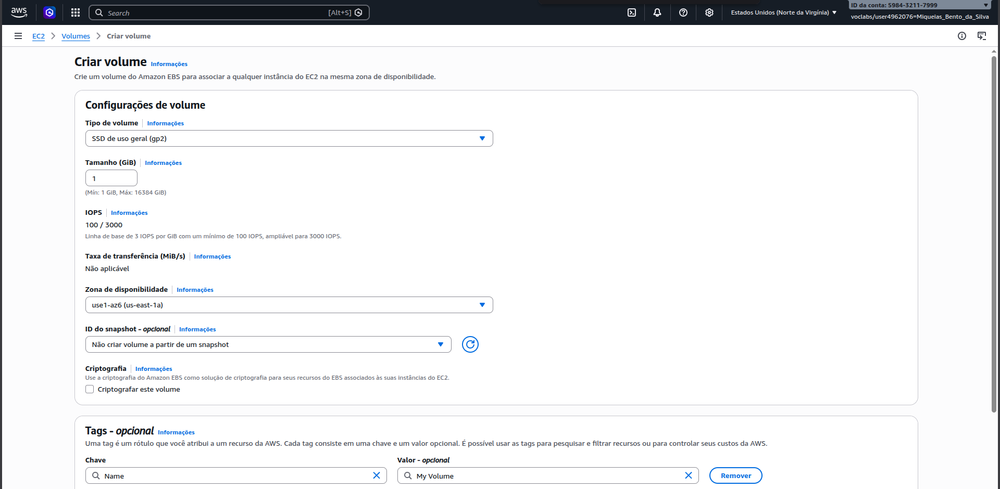
Acesso ao menu de Volumes do EBS para a criação de um armazenamento de blocos personalizado, estipulando atributos como o tipo de disco, a capacidade alocada e a zona de disponibilidade (garantindo sua compatibilidade com a instância alvo).

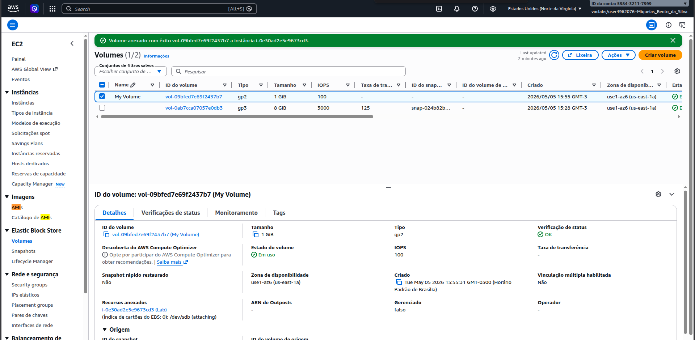
Comprovação no console de gerenciamento indicando que a rotina de anexação (attach) vinculou de maneira bem-sucedida o volume recém-criado à instância EC2 em execução.

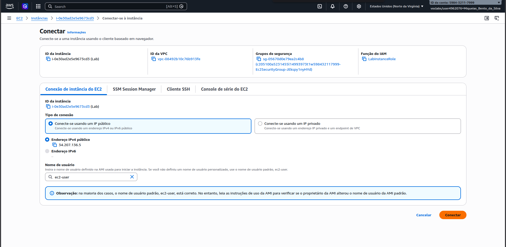
Início do procedimento para estabelecimento de conexão SSH com a instância EC2, pré-requisito fundamental para lidar com o volume bruto recém-atrelado.

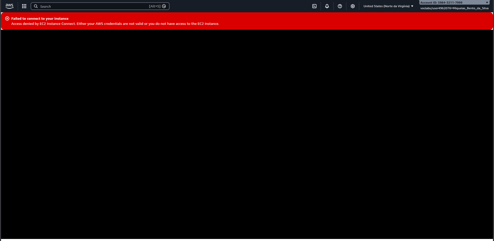
Sinalização de um erro momentâneo de conectividade, resultante de problemas com chaves SSH ou de rotas, que instigou uma abordagem alternativa documentada no relato.

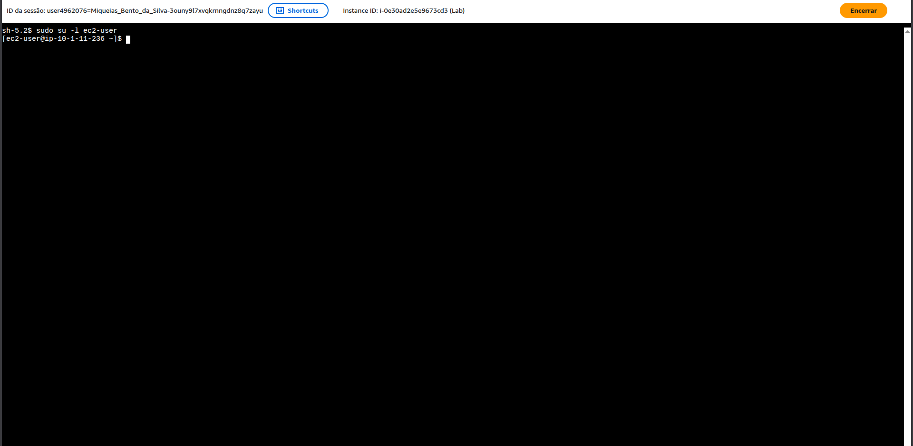
Acesso definitivo e bem-sucedido ao ambiente de linha de comando Linux, efetuado através do uso do AWS EC2 Instance Connect.

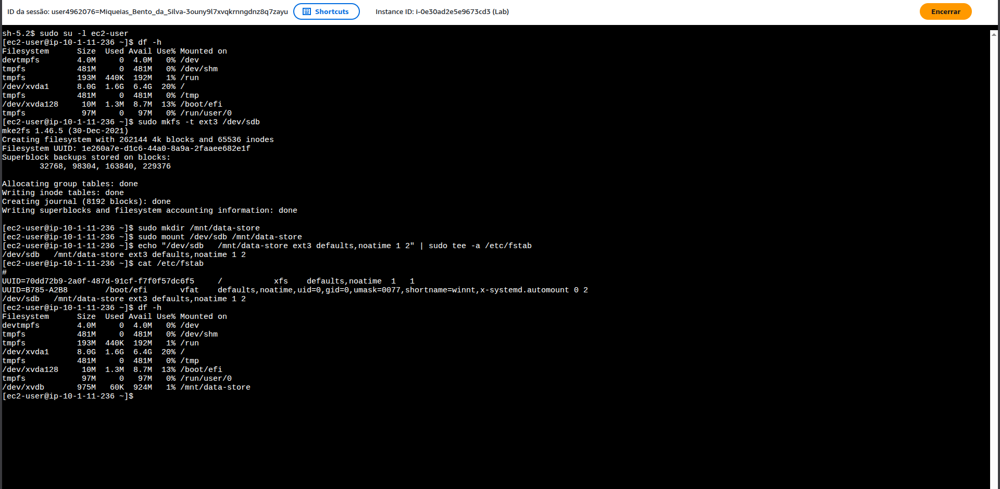
Uso de comandos administrativos de terminal (`lsblk`, `mkfs`, `mount`) para reconhecer o novo disco em bloco, formatá-lo com o respectivo sistema de arquivos e montá-lo na hierarquia de diretórios da máquina.

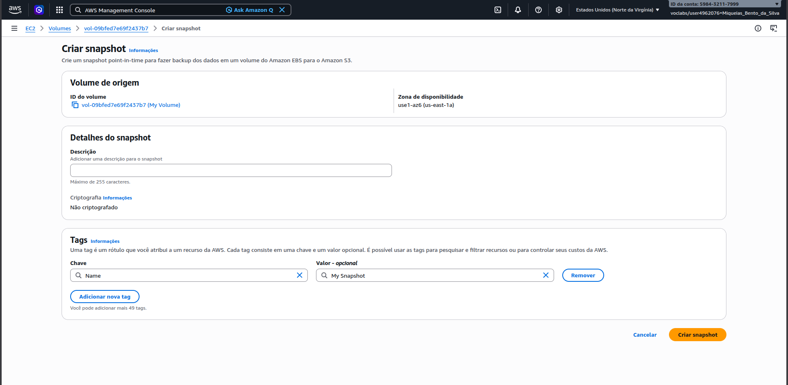
Acompanhamento através do console da AWS da inicialização da criação de um Snapshot sobre o volume, gerando uma imagem de backup pontual contendo os dados presentes no momento.

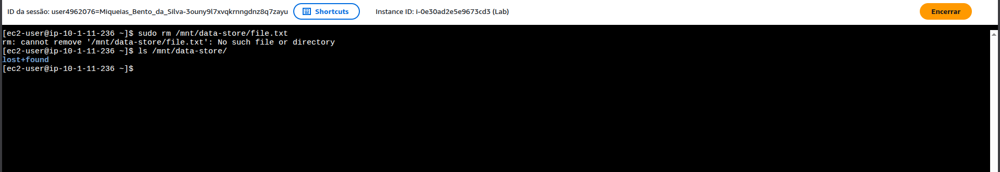
Demonstração efetuada no terminal executando comandos operacionais (como tentar remover arquivos do volume) para criar um cenário de perda de dados e comprovar a necessidade de um sistema de recuperação.

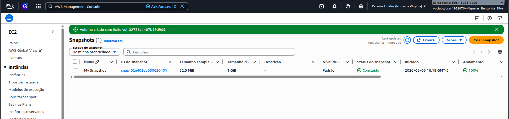
Etapa de criação de um novo e independente volume EBS cuja referência original de dados apontou para o Snapshot recém-registrado, constituindo a via de restauração efetiva.

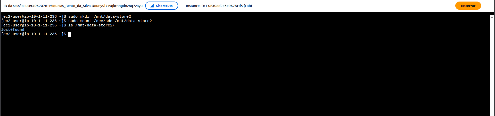
Validação final do processo confirmando que o sistema operacional, ao montar o volume restaurado na máquina virtual, recupera totalmente a estrutura e a integridade de dados contidas no backup original.

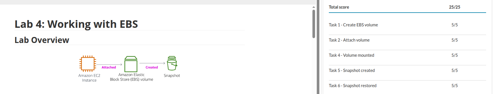
Pontuação final obtida no laboratório.