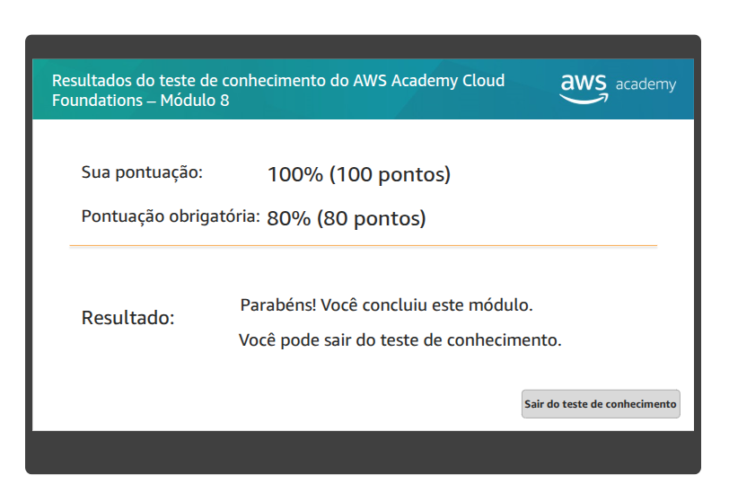

# Atividade 09 - Banco de Dados

## Questão 01

Resolva o Teste de Conhecimento do Módulo 8: Bancos de dados.

## Questão 02
> No laboratório - A ser entregue na aula - 12/05 - não vale se for entregue depois

Complete todas as etapas do Laboratório 5 - Crie um servidor de banco de dados e interaja com o banco de dados usando um aplicativo.

Para comprovar estas atividades, eu acessarei a AWS e verificarei a nota do teste e a avaliação do laboratório.
