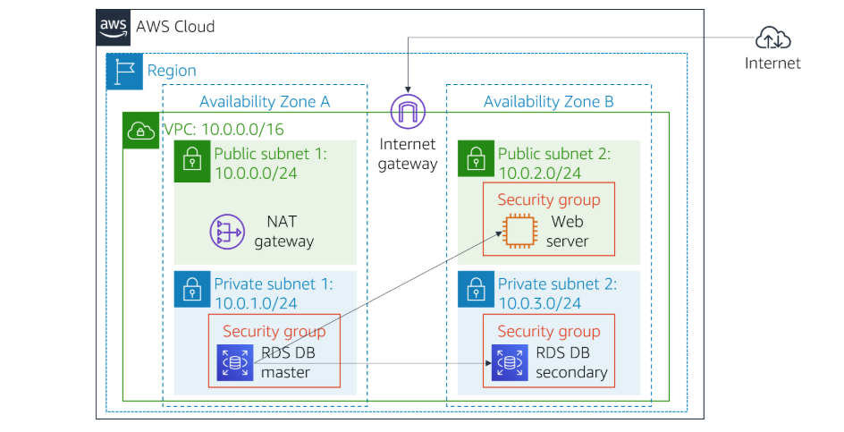
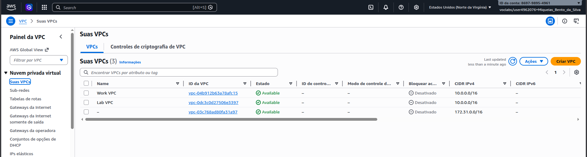
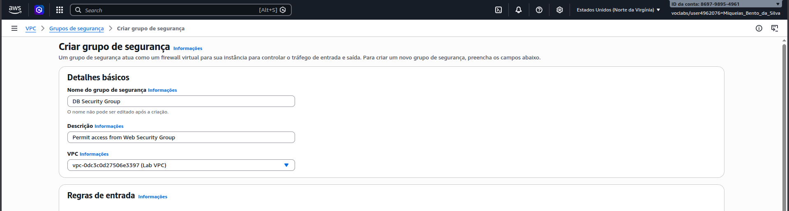
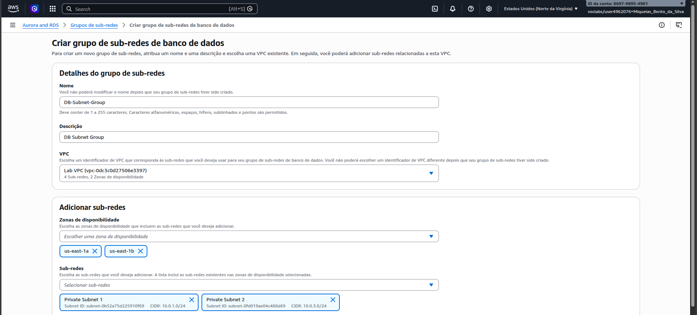
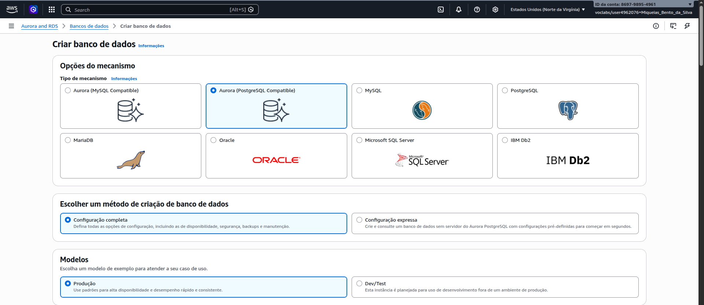
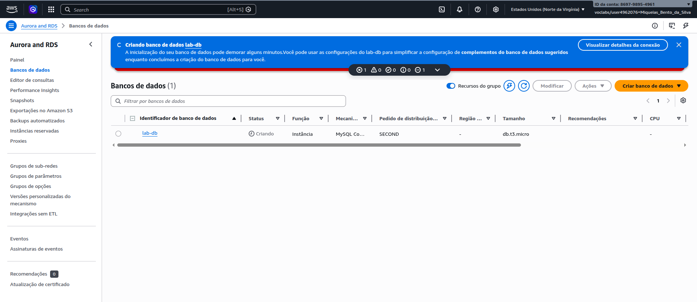
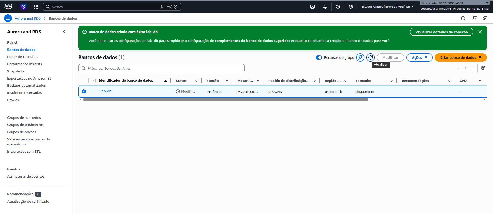
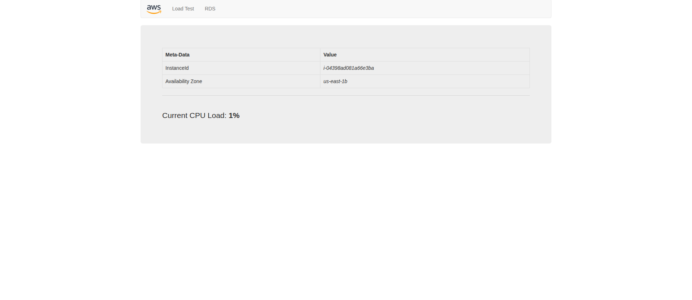
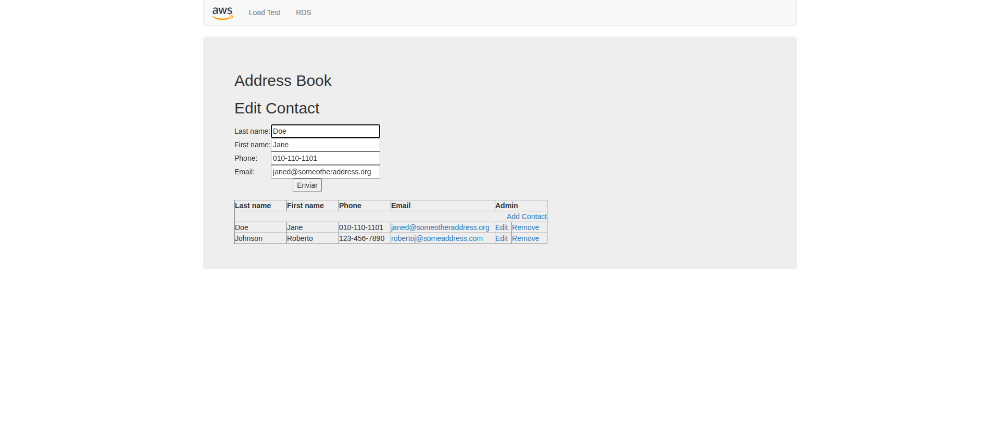
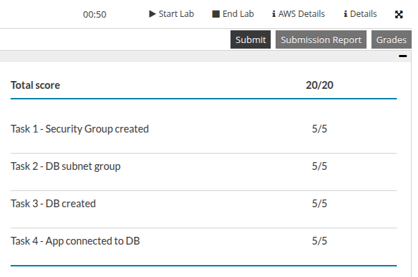

# Relatório: Laboratório 5 - Crie um servidor de banco de dados e interaja com o banco de dados usando um aplicativo

Relatório das etapas executadas para criação de um servidor de banco de dados relacional (RDS) e a integração com uma aplicação web.

---

## Passos da Execução

Diagrama da arquitetura de rede e de banco de dados que foi implantada no laboratório.

A VPC e as sub-redes pré-provisionadas para a execução da atividade prática.

Criação do grupo de segurança específico para autorizar e controlar o acesso de rede à instância de banco de dados.

Configuração do grupo de sub-redes no RDS associando diferentes zonas de disponibilidade para garantir alta disponibilidade ao banco de dados.

Início da criação da instância de banco de dados relacional MySQL por meio do console do Amazon RDS.

Acompanhamento do processo de inicialização e provisionamento da instância do banco de dados.

Confirmação do estado ativo e disponível do servidor de banco de dados MySQL.

Página web da aplicação em execução no EC2.

Edição de dados do banco de dados por meio da aplicação web.

Resultado final do laboratório, totalmente concluído.
