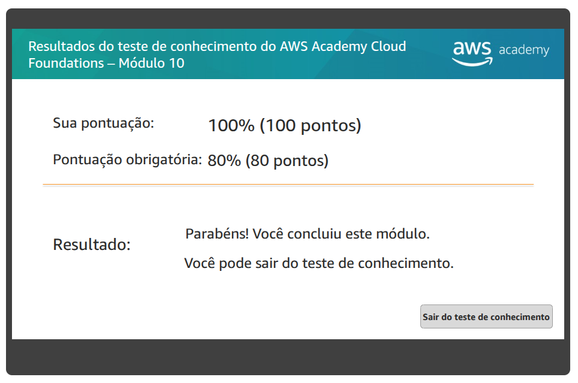

# Atividade 11 - Auto Scaling e Monitoramento

## Questão 01

Resolva o Teste de Conhecimento do Módulo 10: Auto Scaling e monitoramento.

## Questão 02 - No laboratório - A ser entregue na aula - 02/06 - não vale se for entregue depois

Complete todas as etapas do Laboratório 6 - Ajuste a escala e o balanceamento de carga da arquitetura.

Para comprovar estas atividades, eu acessarei a AWS e verificarei a nota do teste e a avaliação do laboratório.

Relatório: [relatório](./relatorio.md)
