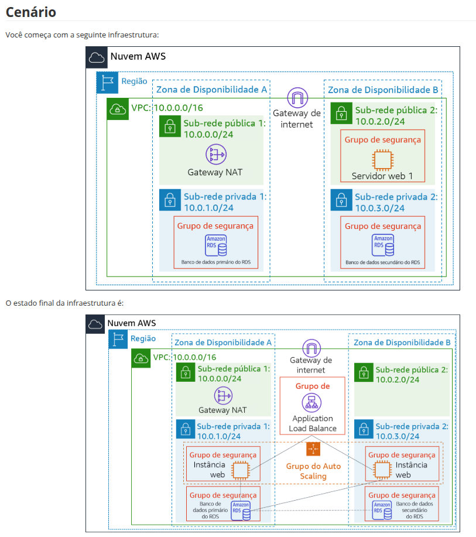
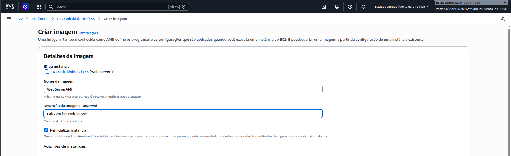
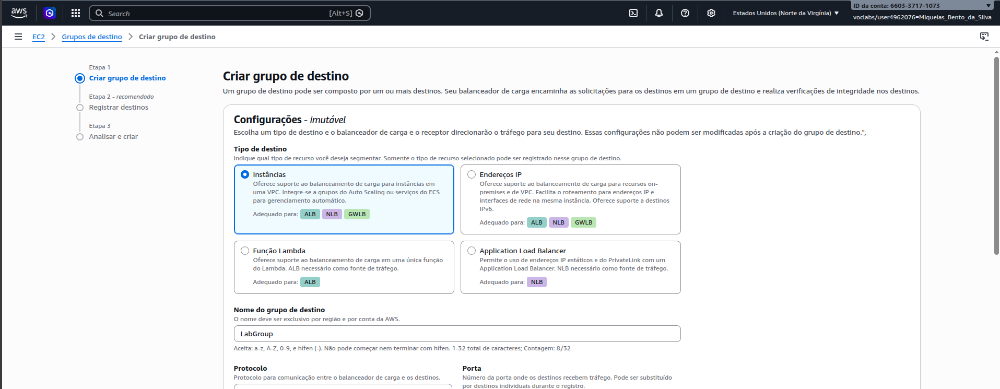
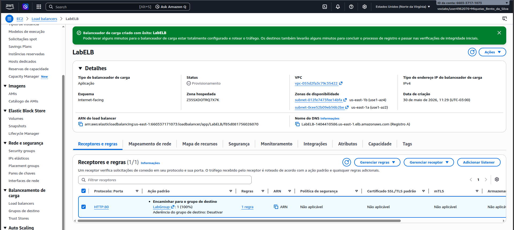
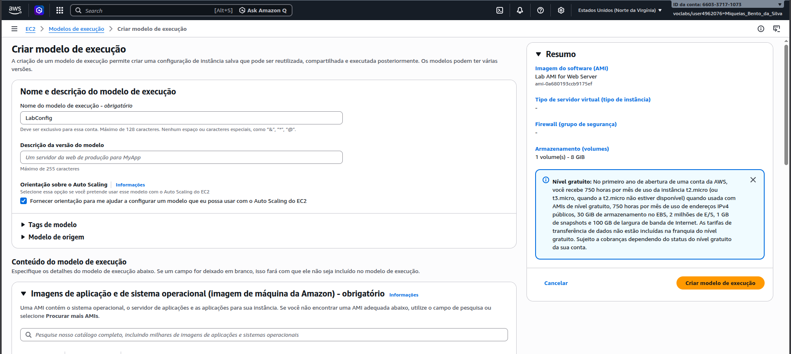
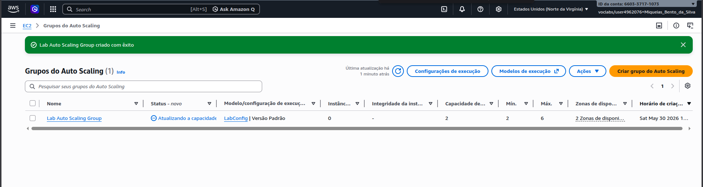
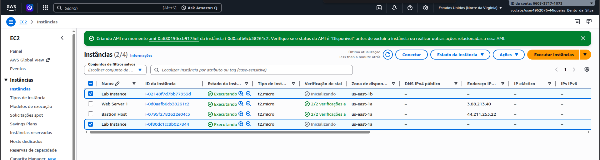
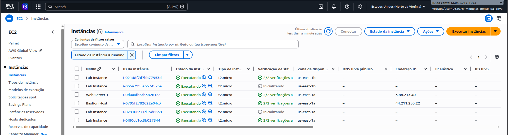
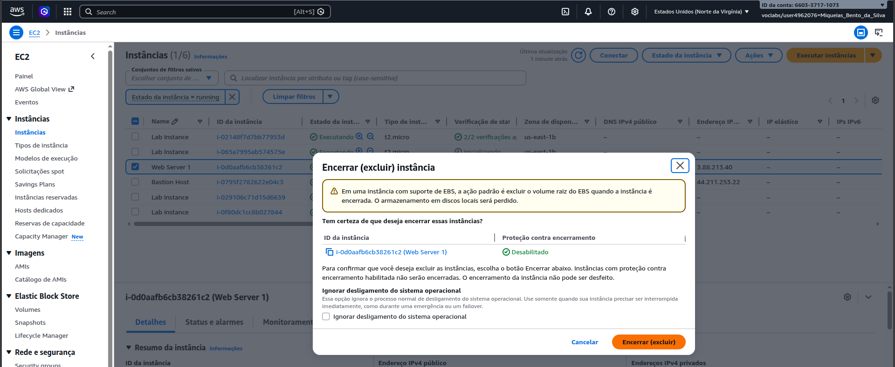
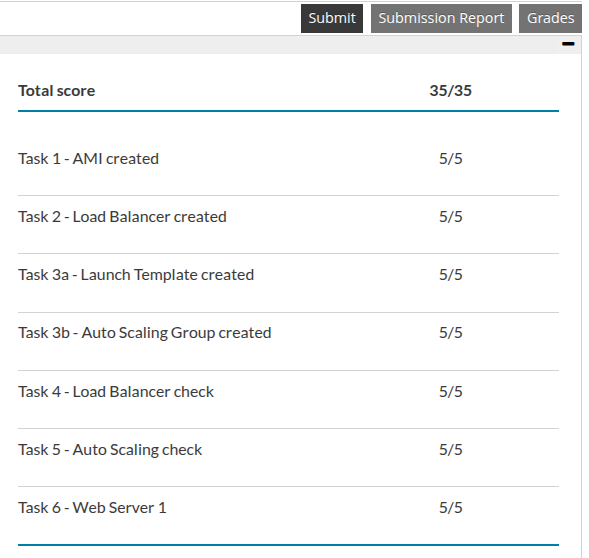

# Relatório: Laboratório 6 - Ajuste a escala e o balanceamento de carga da arquitetura

Relatório descrevendo as atividades executadas no laboratório focado na implementação de Auto Scaling e Monitoramento(Módulo 10), utilizando Application Load Balancer (ALB) e Auto Scaling Groups.

---

## Registros

Visualização do diagrama da arquitetura proposta para a implementação de balanceamento de carga e auto-scaling.

Criei uma Amazon Machine Image (AMI) personalizada a partir de uma instância EC2 configurada previamente.

Criei e configurei um grupo de destino (Target Group) para gerenciar e direcionar o tráfego do balanceador.

Criei um Application Load Balancer (ALB) para distribuir as conexões de entrada entre as zonas de disponibilidade.

Configurei o modelo de execução (Launch Template) contendo os parâmetros de hardware, rede e a AMI gerada.

Criei o Auto Scaling Group vinculando as sub-redes e especificando os limites mínimo, desejado e máximo.

Verificação da ativação e a inicialização automática das instâncias EC2 pelo serviço de escalabilidade.

Monitoramento da escala horizontal e a criação de instâncias adicionais após a aplicação de estresse de carga na CPU.

Desligamento manual dos recursos para validar a recuperação automática e a política de redução da infraestrutura.

Finalização do lab e pontuação recebida.
