# Relatório do Laboratório 1 - Criando Máquinas Virtuais

Este relatório documenta a realização da prática de criação e conexão de Máquinas Virtuais na AWS.

---

## Questão 1

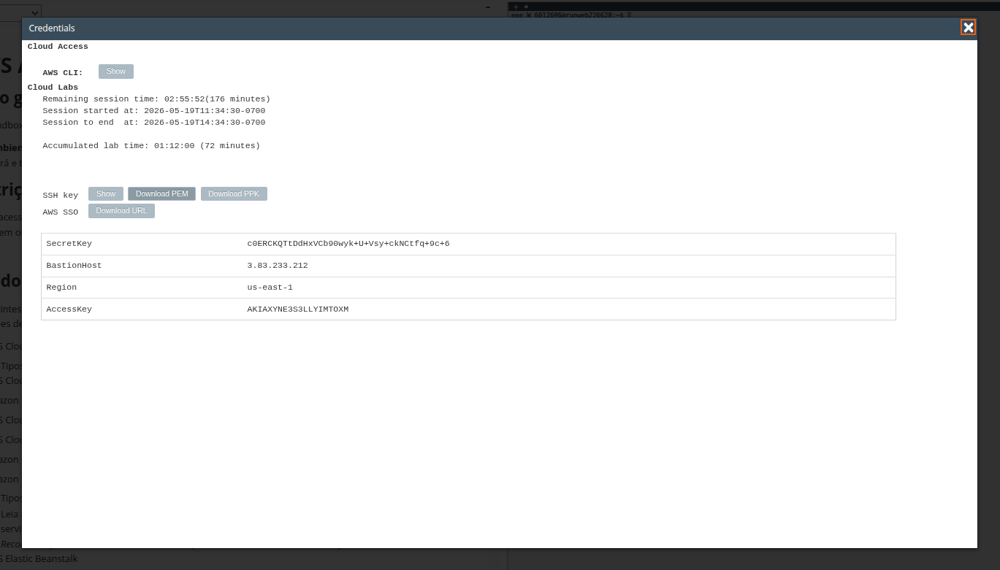
*Figura 1: Credenciais de acesso ao ambiente prático no AWS Academy Sandbox.*

**Explicação (Chave PEM):**
Uma chave PEM (.pem) é um arquivo de certificado digital codificado em Base64 usado para autenticar conexões seguras via SSH a instâncias de servidores virtuais (como o EC2) de forma criptografada e sem a necessidade de digitação de senhas.

---

## Questão 2

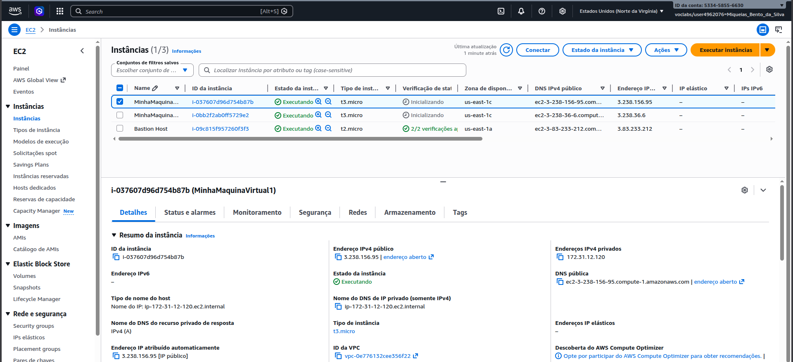
*Figura 2: Detalhes da primeira instância EC2 criada no console da AWS.*

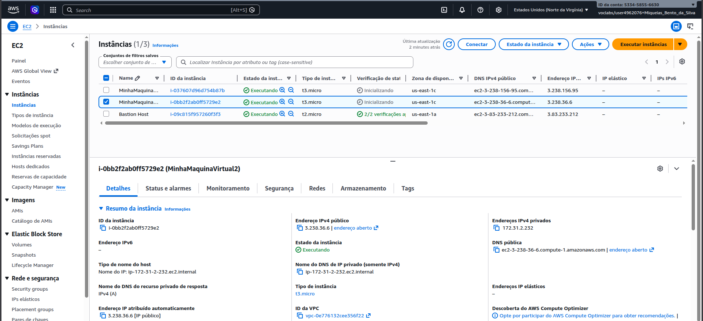
*Figura 3: Detalhes da segunda instância EC2 criada no console da AWS.*

### Informações das Instâncias Criadas:

*   **MinhaMaquinaVirtual1**
    *   **Endereço IPv4 Público:** `3.238.156.95`
    *   **DNS Público:** `ec2-3-238-156-95.compute-1.amazonaws.com`
    *   **Tipo de Instância:** `t2.micro`
    *   **Armazenamento:** 8 GiB gp3 (3000 IOPS) ou gp2 (100 IOPS) conforme o padrão.
    *   **Grupos de Segurança e Regras de Entrada:** Associada a um grupo de segurança que permite apenas tráfego SSH de entrada na porta 22.

*   **MinhaMaquinaVirtual2**
    *   **Endereço IPv4 Público:** `3.238.36.6`
    *   **DNS Público:** `ec2-3-238-36-6.compute-1.amazonaws.com`
    *   **Tipo de Instância:** `t2.micro`
    *   **Armazenamento:** 8 GiB gp3 (3000 IOPS) ou gp2 (100 IOPS) conforme o padrão.
    *   **Grupos de Segurança e Regras de Entrada:** Associada a um grupo de segurança que permite apenas tráfego SSH de entrada na porta 22.

---

## Questão 3

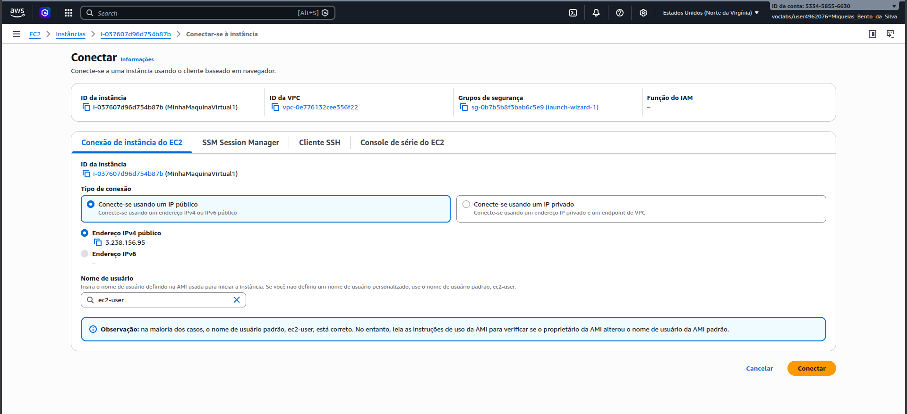
*Figura 4: Tela de opções para conexão à MinhaMaquinaVirtual1 via EC2 Instance Connect.*

*   **Nome de usuário padrão:** `ec2-user`

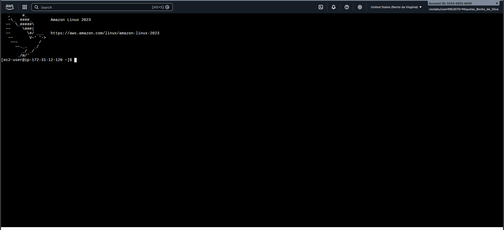
*Figura 5: Terminal aberto com sucesso através do EC2 Instance Connect.*

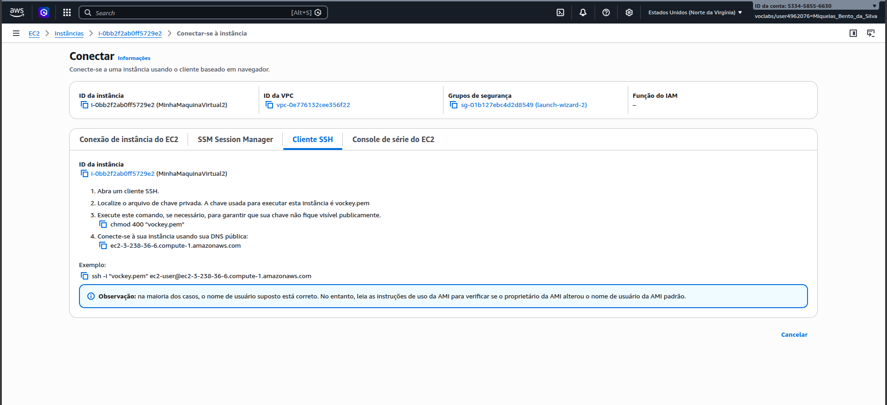
*Figura 6: Instruções e comando SSH para conectar à MinhaMaquinaVirtual2.*

.png)
*Figura 7: Falha de conexão SSH ao tentar conectar diretamente da MinhaMaquinaVirtual1 para a MinhaMaquinaVirtual2.*

**Explicação do ocorrido:**
A tentativa de conexão SSH falhou com o erro de "Permission denied" porque a chave privada `.pem` necessária para autenticação não estava presente no sistema de arquivos da MinhaMaquinaVirtual1.

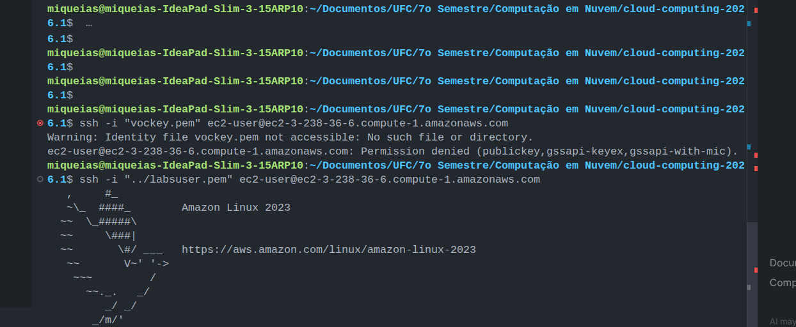
*Figura 8: Conexão SSH à MinhaMaquinaVirtual2 estabelecida com sucesso através do terminal da máquina física local.*

---

## Questão 4

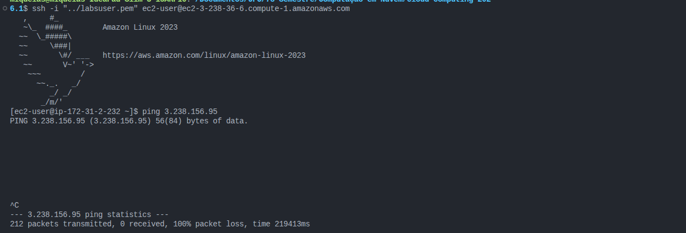
*Figura 9: Execução do comando ping a partir da MinhaMaquinaVirtual2 para a MinhaMaquinaVirtual1 resultando em 100% de perda de pacotes.*

**Explicação do ocorrido, motivo e solução:**
O ping falhou porque o Grupo de Segurança da MinhaMaquinaVirtual1 bloqueia por padrão todo o tráfego de entrada do protocolo ICMP (usado pelo ping), sendo necessário adicionar uma regra de entrada para liberar "ICMP personalizado - IPv4" na console AWS.

A tela de regras de entrada do Grupo de Segurança define quais tipos de tráfego de rede e portas estão liberados para entrar na instância, sendo a responsável direta pelo bloqueio do ping caso a regra ICMP não esteja presente.

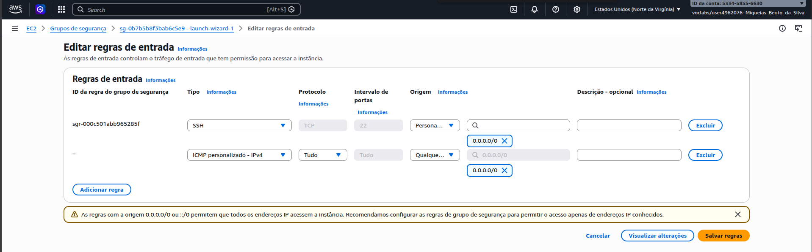
*Figura 10: Inclusão da regra para tráfego ICMP personalizado (IPv4) a partir de qualquer origem (0.0.0.0/0) nas regras de entrada do Grupo de Segurança.*

**Resultado do novo teste de ping:**
Após a liberação do protocolo ICMP no Grupo de Segurança, o comando ping foi bem-sucedido e os pacotes de eco foram respondidos corretamente sem perdas.

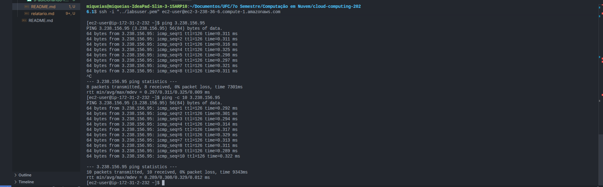
*Figura 11: Execução bem-sucedida do comando ping entre as instâncias após a liberação da regra de segurança.*

---

## Questão 5

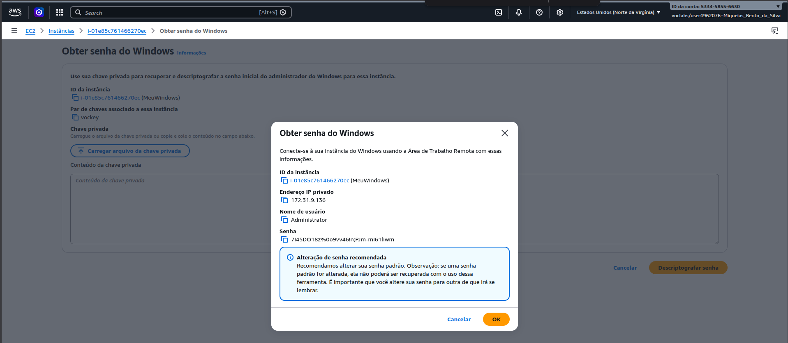
*Figura 12: Descriptografia realizada com sucesso e exibição do usuário administrador e sua respectiva senha gerada.*

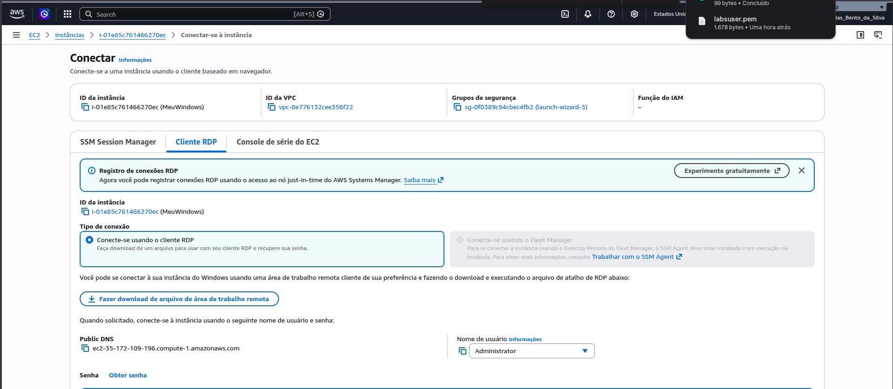
*Figura 13: Configuração e download do arquivo RDP para acesso à instância Windows.*

**Explicação (Cliente RDP):**
Um cliente RDP (Remote Desktop Protocol) é um software que permite ao usuário se conectar, visualizar e controlar a interface gráfica de um computador ou servidor remoto através da rede.

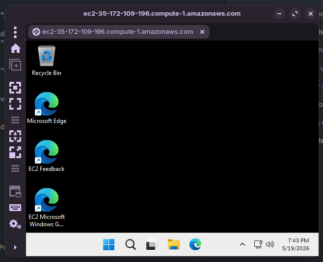
*Figura 14: Área de trabalho remota da instância do Windows (MeuWindows) acessada com sucesso.*
