# Relatório do Laboratório 2 - Linha de Comando

## Questão 1
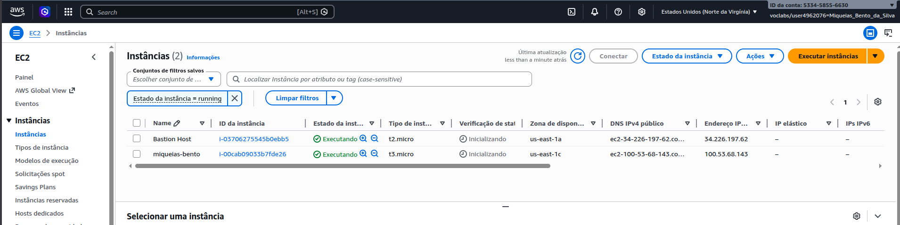
Criação da instância com o nome "miqueias-bento".

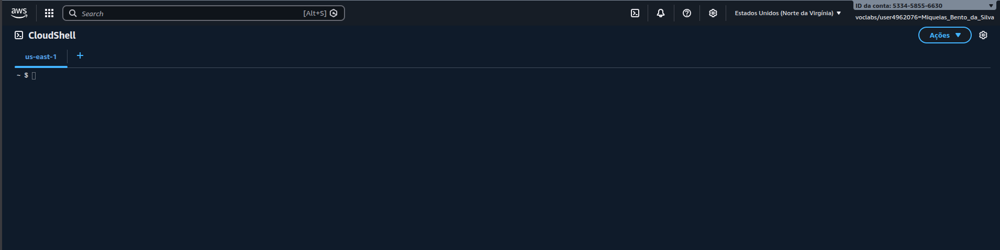
Acesso ao CloudShell. 

## Questão 2
Para cada comando a seguir, ajuste para a sua máquina virtual (geralmente o id ou nome da máquina virtual) e execute.
Alguns comandos vão resultar num erro propositadamente.
Relate o resultado de cada um. Pode ser textual, pode ser um print de parte da tela.

* `aws ec2 describe-instances`  
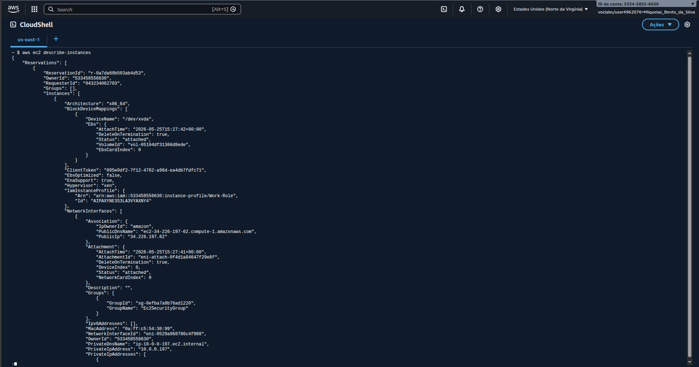
  Listou todas as instâncias EC2 disponíveis na conta e região configuradas no ambiente da AWS CLI, retornando informações detalhadas sobre cada máquina virtual.

* `aws ec2 describe-instances --instance-ids i-1234567890abcdef0`  
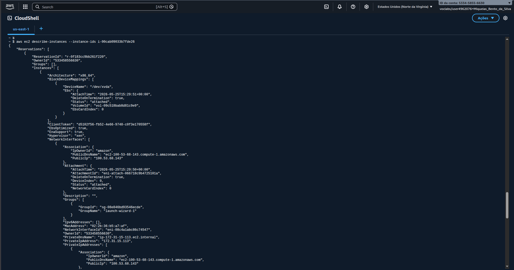
  Consultou especificamente uma instância EC2 a partir do seu identificador único (`InstanceId`), retornando apenas os dados relacionados àquela máquina virtual.

* `aws ec2 describe-instances --output yaml --region us-east-1`  
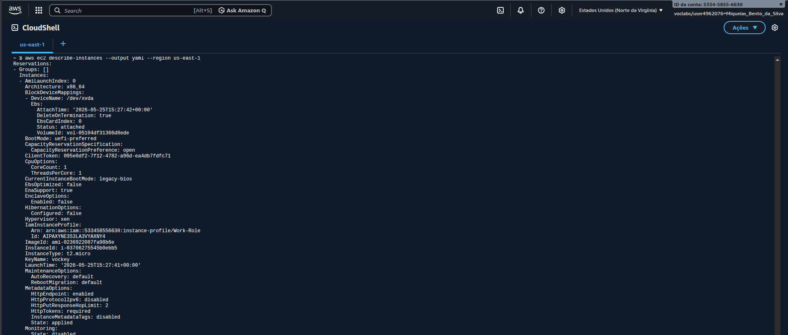
  Listou as instâncias EC2 da região `us-east-1`, exibindo os resultados no formato YAML para facilitar a leitura estruturada das informações.

* `aws ec2 describe-instances --filters "Name=instance-type,Values=t2.nano"`  
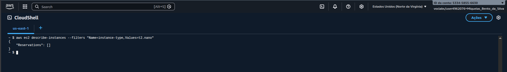 
  Listou apenas as instâncias EC2 que possuíam o tipo `t2.nano`, permitindo identificar máquinas com essa configuração específica.  
  Minha VM não foi listada aqui.

* `aws ec2 describe-instances --filters "Name=instance-type,Values=t3.micro"`  
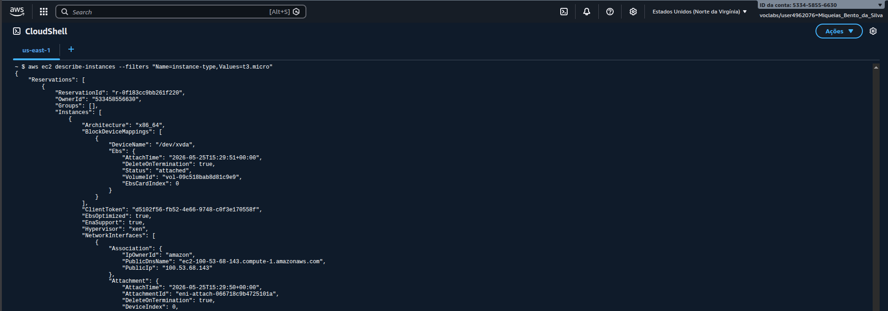
  Listou exclusivamente as instâncias do tipo `t3.micro`, retornando apenas máquinas virtuais compatíveis com esse perfil de hardware.  
  Minha VM foi listada aqui.

* `aws ec2 describe-instances --filters "Name=tag:Name,Values=umNomeQualquerDiferenteDaMinhaMV"`  
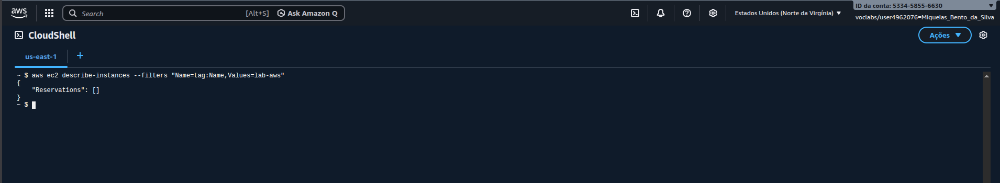
  Buscou instâncias EC2 com uma tag `Name` diferente do nome da máquina virtual criada, demonstrando o funcionamento de filtros por tags na AWS.  
  Minha VM não foi listada aqui.

* `aws ec2 describe-instances --filters "Name=tag:Name,Values=oNomeDaMinhaVM"`  
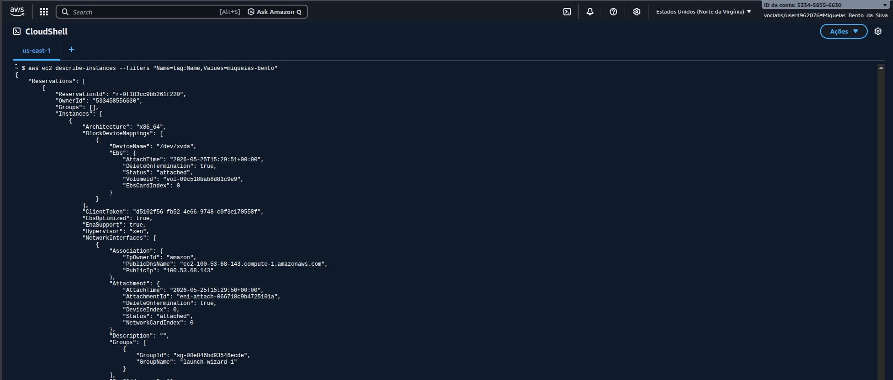
  Localizou a instância EC2 criada no laboratório por meio da tag `Name`, retornando apenas a máquina virtual correspondente.  
  Minha VM foi listada aqui.

* `aws ec2 describe-instances --filters "Name=tag:Name,Values=oNomeDaMinhaVM" --output yaml`  
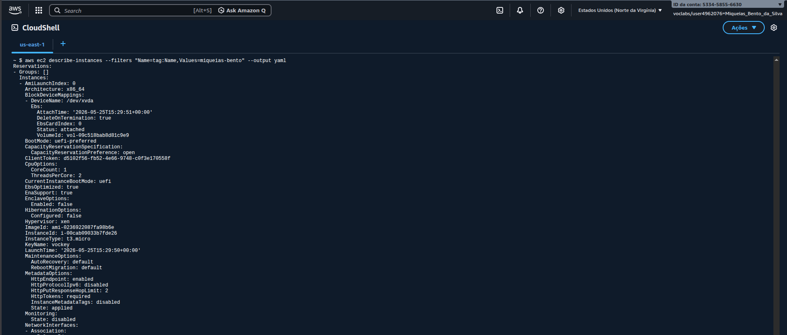
  Consultou a instância EC2 pelo nome definido na tag `Name`, exibindo os resultados no formato YAML para melhor organização visual das informações retornadas.  
  Minha VM foi listada aqui.

* `aws ec2 describe-instances --query "Reservations[*].Instances[*].{Instance:InstanceId,Subnet:SubnetId}" --output json`  
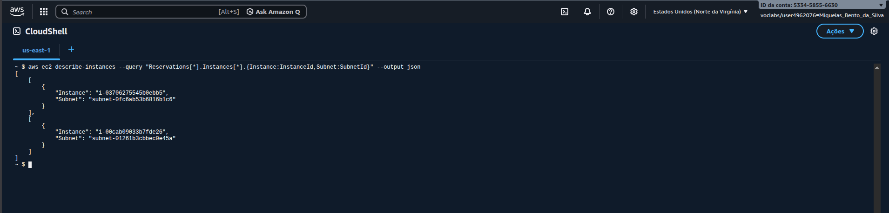
  Extraiu apenas os identificadores das instâncias (`InstanceId`) e das sub-redes (`SubnetId`), utilizando consultas customizadas da AWS CLI e exibindo o resultado em formato JSON.  
  Minha VM foi listada aqui.

* `aws ec2 describe-instances --filters Name=instance-type,Values=t2.micro --query Reservations[*].Instances[*].[InstanceId] --output text`  
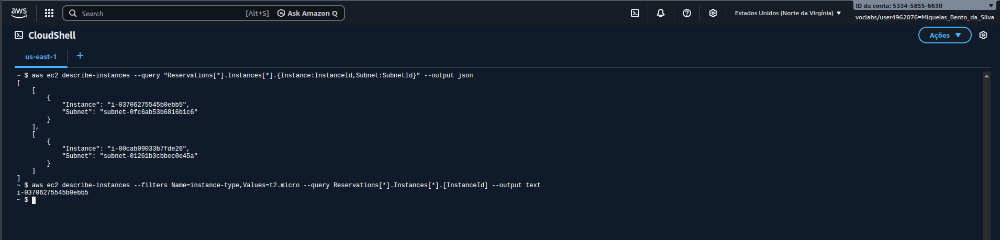
  Listou somente os identificadores das instâncias do tipo `t2.micro`, apresentando os resultados em formato texto simplificado.  
  Minha VM foi listada aqui.

* `aws ec2 start-instances --instance-ids i-1234567890abcdef0`  
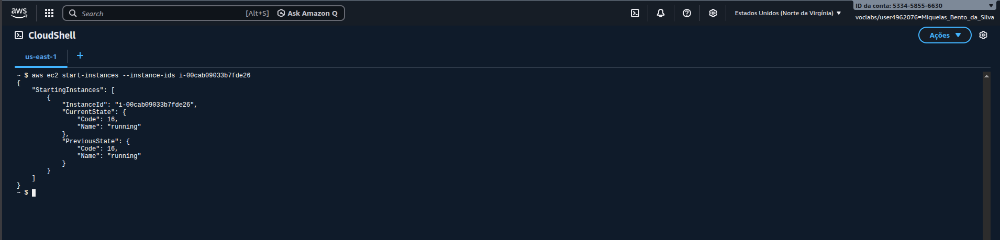
  Iniciou uma instância EC2 previamente desligada, alterando seu estado para execução (`running`).

* `aws ec2 stop-instances --instance-ids i-1234567890abcdef0`  

  Interrompeu a execução de uma instância EC2 em funcionamento, alterando seu estado para parada (`stopping`).

## Questão 3
Os comandos a seguir criarão buckets no S3.
Dependendo da disponibilidade de nomes de buckets, você criará dois.
Ajuste os comandos conforme o nome e execute.
Alguns comandos vão resultar num erro propositadamente.
Relate o resultado de cada um. Pode ser textual, pode ser um print de parte da tela.

* `aws s3 ls`  
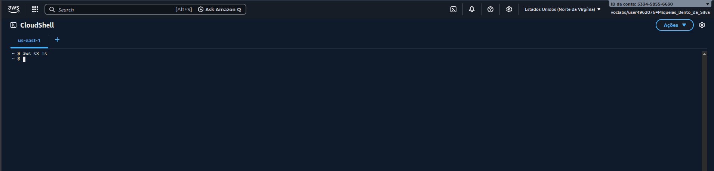  
Listou os buckets S3 disponíveis na conta AWS configurada no ambiente. No caso, nenhum bucket estava disponível até o momento.

* `aws s3 mb s3://bucketA`  
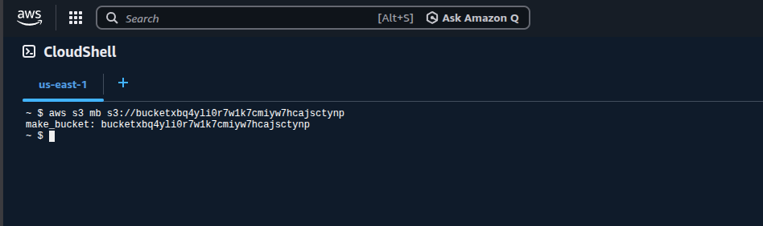  
Finalmente criou um bucket na conta AWS configurada no ambiente.
Tive que consultar as regras da criação de buckets S3, pois a primeira tentativa falhou.  
O nome do bucket criado foi `bucketxbq4yli0r7w1k7cmiyw7hcajsctynp`.

* `aws s3 ls s3://bucketA`  
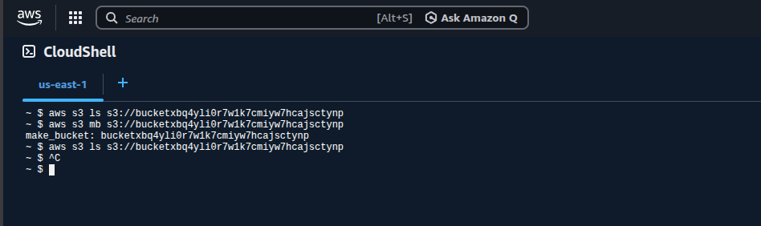  
O terminal não exibe nenhuma linha de texto e pula para a próxima linha, pois o bucket não tem nenhum arquivo ainda.

* `cat > novo_arquivo.txt`  
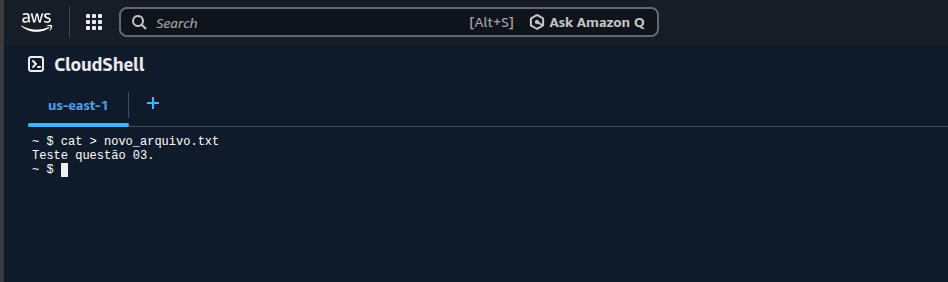  
Criação de um arquivo de texto chamado `novo_arquivo.txt` diretamente pelo terminal, coloquei o texto simples "Teste questão 03.".

* `aws s3 cp novo_arquivo.txt s3://bucketA`  
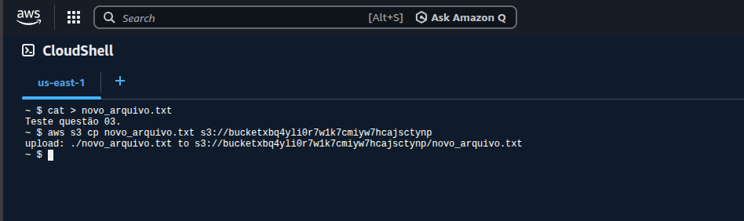  
Confirmação do upload do arquivo local para a nuvem

* `aws s3 rb s3://bucketA`  
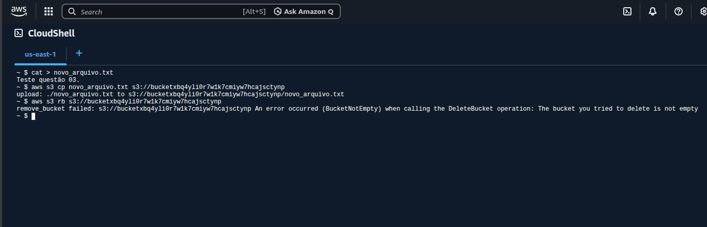  
O comando `rb` (remove bucket) falhou porque o bucket recebeu o arquivo no passo anterior.

* `aws s3 cp s3://bucketA/novo_arquivo.txt velho_arquivo.txt`  
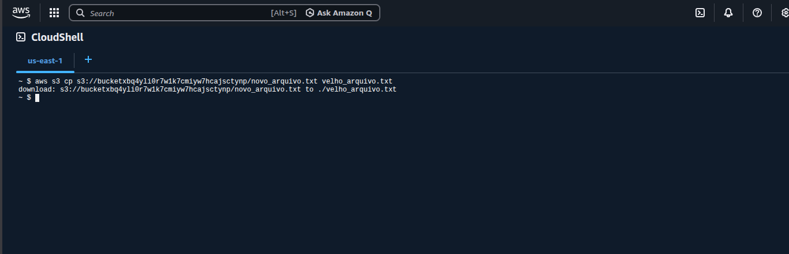  
Baixou o arquivo do S3 para a máquina local do CloudShell com um novo nome.

* `aws s3 mb s3://bucketB`  
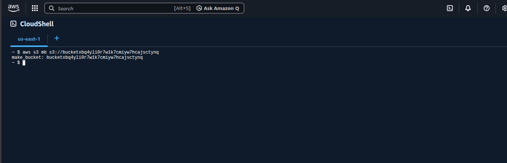  
Confirmação de que o seu segundo bucket (`bucketzbq4yli0r7w1k7cmiyw7hcajsctynp`) foi criado.

* `aws s3 mv s3://bucketA/novo_arquivo.txt s3://bucketB/outro_novo_arquivo.txt`  
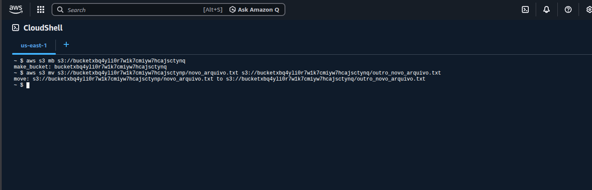  
Pelo que entendi, o comando moveu o arquivo entre os buckets (copia para o B e deleta do A).

* `aws s3 rb s3://bucketA`  
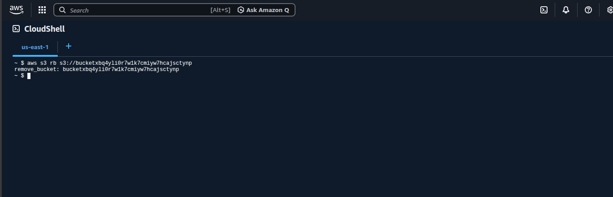  
Removeu o único arquivo que estava dentro do bucket finalizado em p, ele agora está vazio e pode ser excluído.

* `aws s3 rb s3://bucketB --force`  
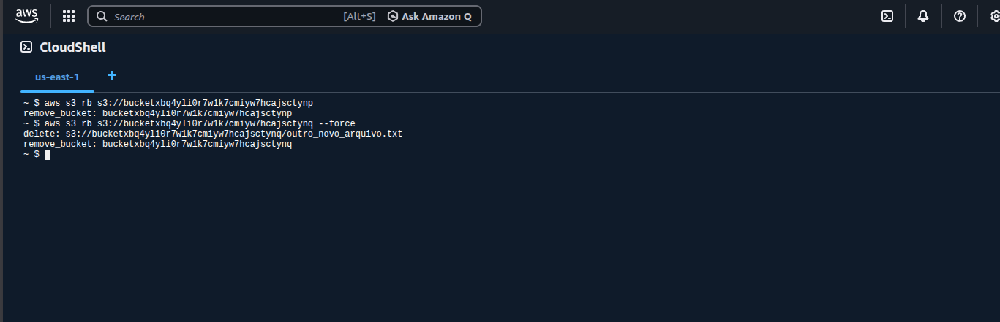  
O bucket finalizado em q continha o arquivo `outro_novo_arquivo.txt`, e o parâmetro `--force` apagou primeiro o arquivo interno e depois removeu o bucket de forma forçada.
